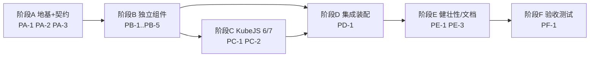

# reloadonlydata 平行任务表（多 Agent 并行）

> 依据：[reload-only-recipes-design.md](reload-only-recipes-design.md)（总设计）+ [task-plan.md](task-plan.md)（总任务表）。
> 目的：把全部工作拆成**阶段 × 平行任务**，供多个 agent 同时施工。
> **核心规则：同一阶段内的平行任务彼此不依赖、且不修改同一文件（可并行）；不同阶段之间可依赖（串行推进）。**

---

## 0. 给 Agent 的使用说明

1. **认领**：选一个「其所属阶段的前置阶段已全部 ☑」且状态为 ☐ 的平行任务，把它改为 ◐ 并署名。
2. **施工**：只修改本任务 **Owns** 列出的文件；**Reads** 列出的文件/接口**只读**，不得修改。
3. **完成后更新进度（用户要求的两个文档 + 本表，共三处）**：见 §1 协议。
4. **不确定接口**：一律以 §2「共享约定（冻结）」为准；需改约定走 §1.6 变更请求。

状态图例：☐ 待办 · ◐ 进行中 · ☑ 完成 · ⛔ 阻塞。

---

## 1. 协作与进度更新协议

1. **文件所有权唯一**：每个文件只属于一个平行任务（见 §6 所有权矩阵）。跨任务/跨阶段的协作只能通过 **Reads（只读接口）**，不得改他人 Owns 文件。
2. **认领登记**：开工前将本表该任务 ☐→◐ 并在「负责」栏写 agent 标识。
3. **完成后，逐一更新三处**：
   - (a) **本表**：该任务 ◐→☑，在「产出」栏填实际交付文件/结论。
   - (b) **总任务表** [task-plan.md](task-plan.md)：勾选该任务「映射」栏列出的 `T*` 复选框（☐→☑）。
   - (c) **总设计文档** [reload-only-recipes-design.md](reload-only-recipes-design.md)：若本任务**落地了待验证项或引入设计变更**，更新对应章节；否则在本表「产出」栏注明「无设计变更」。
4. **冲突规避**：进度更新是**逐行精确替换**（只改本任务对应的那一行/小节）。替换前先读取最新内容；若 `oldString` 不匹配（他人已改动同一区域），**重新读取后再改**，绝不整段覆盖。
5. **阶段同步点（Gate）**：某阶段所有任务 ☑ 后，由「集成 agent」执行两版 `build` + `runClient` 冒烟，通过才解锁下一阶段。见每阶段末的 **Gate**。
6. **变更请求（CR）**：需修改 §2 冻结约定或他人 Owns 文件时，在 §7「变更登记」新增一行说明并暂停，协调后再动。

---

## 2. 共享约定（冻结 — 任何人不得擅改）

- **modId** = `reloadonlydata`
- **根包** = `com.tonywww.reloadonlydata`（如需改 group，走 CR，全局统一）
- **mixin 配置文件** = `reloadonlydata.mixins.json`；**refmap** = `reloadonlydata.refmap.json`
- **翻译 key 前缀** = `reloadonlydata.` / 命令反馈 `commands.reloadonlydata.*`
- **冻结接口签名**（阶段 A 产出，B/C/D 只读依赖）：
  - `RecipeReloadStrategy.reload(MinecraftServer server)` — **仅重建配方表，不做同步**。
  - `mixin.RecipeManagerInvoker#reloadonlydata$invokeApply(Map<ResourceLocation, JsonElement>, ResourceManager, ProfilerFiller)`
  - `reload.RecipeReloadService.reload(MinecraftServer server)` — 门面：pick 策略 → 执行 → 同步（骨架在 A，装配在 D）。
  - `reload.RecipeSync.toAllClients(MinecraftServer server, RecipeManager rm)`
  - `reload.CleanServerResources.openClean(MinecraftServer server) : CloseableResourceManager`
- **职责边界**：策略只「重建配方表」；**同步统一由门面 `RecipeReloadService` 调 `RecipeSync`**（故各策略互不依赖同步模块）。
- **双版本隔离**：仅 `//? if forge {}/neoforge {}` 隔离（mod 主类总线 import、`RegisterCommandsEvent` import、KubeJS 兼容整类）；其余两版共用。

---

## 3. 阶段与依赖总览

| 阶段 | 并行任务数 | 前置 | 里程碑 |
|---|---|---|---|
| A 地基+契约 | 3（PA-1/2/3） | — | M0 + 接口冻结 |
| B 独立组件 | 5（PB-1..5） | A | 组件就绪 |
| C KubeJS 兼容 | 2（PC-1/2） | B（PB-3）+ A（PA-3） | 兼容层就绪 |
| D 集成装配 | 1（PD-1） | B + C | M1/M2 端到端 |
| E 健壮性/文档 | 2（PE-1/PE-3） | D | 可发布质量 |
| F 验收测试 | 1（PF-1） | E | M3 |

---

## 4. 平行任务详情

### 阶段 A · 地基与契约（前置：无）

> PA-1 与 PA-2 文件不重叠，可并行编写；均以 §2 冻结约定为准，阶段末在 Gate 合并验证。PA-3 为纯研究，零文件冲突。

**PA-1 · 构建与元数据脚手架**  ☑ 负责:Agent2 产出:见下 ✅
- Owns：`gradle/**`、`gradlew*`、`settings.gradle.kts`、`stonecutter.gradle.kts`、`build.gradle.kts`、`gradle.properties`、`versions/1.20.1-forge/gradle.properties`、`versions/1.21.1-neoforge/gradle.properties`、`src/main/resources/META-INF/mods.toml`、`src/main/resources/META-INF/neoforge.mods.toml`
- Reads：references/[multiloader-build.md](references/multiloader-build.md)、[stonecutter.md](references/stonecutter.md)
- 含 **R1**：查 Maven 填最新版本（NeoForge 21.1.x、Architectury Loom、KubeJS 6/7）。
- 交付/验收：两版 `gradlew :<node>:build` 至少配置阶段通过；两个 `.toml` 含 `[[mixins]] config="reloadonlydata.mixins.json"`（json 由 PA-2 建）与 KubeJS 软依赖声明；`modLoader=javafml`。
- 映射：task-plan `T0.1–T0.8`、`T0.10`、`T1.4`。
- ✅ **产出（Agent2）**：脚手架文件全部交付并通过配置验证——
  - **文件**：`settings.gradle.kts`（两节点 + Stonecutter 0.9.6，`kotlinController`）、`stonecutter.gradle.kts`（`active` + `constants.match(loader,"forge","neoforge")`）、`build.gradle.kts`（`loom.platform` 分支、Java 17/21 映射、`officialMojangMappings`、`processResources.expand`、mixin AP）、`gradle.properties`、`versions/1.20.1-forge/gradle.properties`、`versions/1.21.1-neoforge/gradle.properties`、`META-INF/mods.toml` + `META-INF/neoforge.mods.toml`（均含 `[[mixins]] config="reloadonlydata.mixins.json"` + KubeJS 软依赖、`modLoader=javafml`）、Gradle wrapper 9.0.0（`gradlew*` + `gradle-wrapper.jar`）、`gradle/gradle-daemon-jvm.properties`。
  - **R1 版本号落地**：Gradle `9.0.0`、Stonecutter `0.9.6`、Architectury Loom `1.14.473`、Forge `47.4.4`（1.20.1）、NeoForge `21.1.193`（1.21.1）、KubeJS `2001.6.5-build.26`（forge6）/`2101.7.2-build.369`（neoforge7）。
  - **验收**：`gradlew :1.20.1-forge:tasks` 与 `:1.21.1-neoforge:tasks` 均 `BUILD SUCCESSFUL`（配置阶段通过）；`:1.21.1-neoforge:processResources` 执行成功（toml `expand` 正常）；Loom 完整解析并反编译 MC/Forge/NeoForge。
  - ⚠️ **构建约束（供 Gate A 与所有 agent）**：Stonecutter 0.9.6 要求 **Gradle daemon 运行在 Java 21+**。已放 `gradle/gradle-daemon-jvm.properties`（`toolchainVersion=21`），但 Gradle 不会自动下载 JDK——需系统 `JAVA_HOME=<Java21>` 或 IDE Gradle JVM=21，否则报「Dependency requires at least JVM runtime version 21」。已验证可用 JDK：`C:\Program Files\Eclipse Adoptium\jdk-21.0.8.9-hotspot`。
  - **要点**：① `loom.mixin.useLegacyMixinAp=true`（Loom 1.14 默认关 AP；Forge SRG 需 AP 生成 refmap，供 PA-2/PB）。② KubeJS `modCompileOnly` 暂注释，repositories 已加 `maven.saps.dev`+`maven.latvian.dev`，阶段 C 由 PC-1/PC-2 启用。③ T0.7 用 `tasks.matching{ it.name=="createMinecraftArtifacts" }.configureEach{ dependsOn("stonecutterGenerate") }` 规避 Loom 延迟注册的 `named()` not found。
  - 勾选 task-plan `T0.1`–`T0.8`、`T0.10`、`T1.4`（两 toml 的 `[[mixins]]` 声明）。**无设计变更**；M0 的 `runClient`（T0.11）留待 Gate A。

**PA-2 · 契约冻结：主类 + Mixin 骨架 + 接口 + 门面**  ☑ 负责:Agent1
- Owns：`.../reloadonlydata.java`（主类，`//? if` 隔离总线 import）、`.../ModConstants.java`、`.../mixin/RecipeManagerInvoker.java`、`.../mixin/reloadonlydataMixinPlugin.java`、`src/main/resources/reloadonlydata.mixins.json`、`.../reload/RecipeReloadStrategy.java`（接口）、`.../reload/RecipeReloadService.java`（门面**骨架**，`reload()` 先抛 `UnsupportedOperationException`）
- Reads：design §3/§6、references/[loader-platform-api.md](references/loader-platform-api.md) §1/§2
- 交付/验收：**冻结 §2 所有接口签名**；两版编译通过；`runClient` 加载 mixin 无错。
- 映射：task-plan `T0.9`、`T1.1–T1.4`、`T2.1`（接口部分）。
- ✅ **产出（Agent1）**：`ModConstants` / `reloadonlydata`（主类，`//? if` 隔离 `@Mod` import）/ `mixin.RecipeManagerInvoker` / `mixin.reloadonlydataMixinPlugin`（`LoadingModList` `//? if` 隔离）/ `reloadonlydata.mixins.json` / `reload.RecipeReloadStrategy`（接口）/ `reload.RecipeReloadService`（门面骨架，抛 `UnsupportedOperationException`）。**§2 接口签名已冻结**。task-plan 勾选 T0.9/T1.1/T1.2/T1.3（T1.4「toml 声明」属 PA-1；T2.1 接口就绪、`pick()` 待 PD-1）。**无设计变更**。编译验证待 PA-1 build 就绪后于 Gate A 进行。

**PA-3 · 研究：KubeJS 7 脚本重载入口（R2）**  ☑ 负责:Agent3
- Owns：无代码；结论写入本表 §5「研究结论 R2」+ 更新 references/[loader-platform-api.md](references/loader-platform-api.md) §6 的待验证标注。
- Reads：KubeJS `2101` 源码
- 交付/验收：明确 KubeJS7 `ServerScriptManager` 等价 `wrapResourceManager` 的**公开入口**、`kjs$resources` 生命周期、`RECIPES_AFTER_LOADED` 触发方式，足以指导 PC-2。
- 映射：task-plan `T3.0`、`R2`。
- ✅ **产出（Agent3）**：R2 结论已填入 §5（入口＝`ServerScriptManager.reload()` via `RecipeManagerKJS`；`kjs$resources` 复用持久有效；**7 代无需干净 RM**；`RECIPES_AFTER_LOADED` 可选）+ PC-2 兼容流程。已更新 references/loader-platform-api.md §6.2（待验证→已核实）。task-plan 勾选 T3.0、R2。**设计文档无变更**（单版本口径不涉及 7 代；差异归 loader-platform-api.md）。

> **Gate A**：三任务 ☑ 后，集成 agent 跑两版 `build`+`runClient`（空 mod 加载、mixin 无错）→ 达 **M0**，解锁阶段 B/（PA-3 解锁 C 的 PC-2）。

---

### 阶段 B · 独立组件（前置：阶段 A）

> 五个任务文件互不重叠，只 **Reads** PA-2 冻结的接口；策略只重建配方、不做同步（同步归门面）。

**PB-1 · Vanilla 策略**  ☑ 负责:Agent1
- Owns：`.../reload/VanillaRecipeReloadStrategy.java`、`.../reload/RecipeScanner.java`
- Reads：`RecipeReloadStrategy`、`RecipeManagerInvoker`（PA-2）
- 交付/验收：`RecipeScanner.scan(rm)`（`FileToIdConverter.json("recipes")`）+ 策略 `reload()` 调 `invokeApply` **仅重建配方表**；两版编译。
- 映射：task-plan `T2.2`。
- ✅ **产出（Agent1）**：`reload.RecipeScanner`（`FileToIdConverter.json("recipes")` 扫描解析，坏文件跳过并记日志）/ `reload.VanillaRecipeReloadStrategy`（cast `RecipeManagerInvoker` 调 `invokeApply`，仅重建配方表）。两版无 `//? if` 隔离（API 一致）。**已实测两版 `compileJava` BUILD SUCCESSFUL**（neoforge：1 executed；forge：`--rerun-tasks` 3 executed）。运行时「重建配方 + 同步」验证待 M1（PD-1 装配 + T2.5 端到端）。**无设计变更**。

**PB-2 · 客户端同步**  ◐ 负责:Agent2 产出:___
- Owns：`.../reload/RecipeSync.java`
- Reads：MC API（两版一致，见平台文档 §3）
- 交付/验收：`toAllClients(server, rm)` = `ClientboundUpdateRecipesPacket` + `sendInitialRecipeBook`；两版编译。
- 映射：task-plan `T2.3`。

**PB-3 · 干净资源管理器**  ☑ 负责:Agent
- Owns：`.../reload/CleanServerResources.java`
- Reads：MC API（平台文档 §5）
- 交付/验收：`openClean(server)` = `new MultiPackResourceManager(SERVER_DATA, packRepository.openAllSelected())`；调用方负责 `close()`；两版编译。
- 映射：task-plan `T3.2`。
- ✅ **产出（PB-3）**：`reload/CleanServerResources.java`——`openClean(server): CloseableResourceManager`（`new MultiPackResourceManager(SERVER_DATA, server.getPackRepository().openAllSelected())`，调用方 `close()`）。**两版编译通过**：`:1.21.1-neoforge:compileJava` ✅ + `:1.20.1-forge:compileJava` ✅（均 BUILD SUCCESSFUL）。无 `//? if`（两版 API 一致）。**无设计变更**。（7 代/PC-2 无需本工具，仅 6 代/PC-1 用，见 R2。）

**PB-4 · 命令注册（接门面骨架）**  ☑ 负责:Agent1
- Owns：`.../command/ModCommands.java`（独立 `@EventBusSubscriber`，不改主类）
- Reads：`RecipeReloadService`（PA-2 门面骨架）、`RegisterCommandsEvent`（`//? if` 隔离 import）
- 交付/验收：`/reloadrecipes` 注册（权限 2、成功/失败反馈用 §2 翻译 key），命令体调 `RecipeReloadService.reload(server)`；命令可出现（门面此时抛占位异常亦算注册成功）。
- 映射：task-plan `T2.4`、`T2.1`（命令侧）。
- ✅ **产出（Agent1）**：`command.ModCommands`（独立 `@EventBusSubscriber`，不改主类；`//? if` 隔离 `@EventBusSubscriber`/`SubscribeEvent`/`RegisterCommandsEvent` 三处包名）；`/reloadrecipes` 权限 2，命令体调 `RecipeReloadService.reload(server)`，成功/失败走翻译 key。**已实测两版 `compileJava` BUILD SUCCESSFUL**（neoforge 1 executed；forge `--rerun-tasks` 3 executed）。**给 PB-5 的翻译 key 约定**：`commands.reloadonlydata.reload.success`（%1$s=条数，%2$s=耗时 ms）、`commands.reloadonlydata.reload.failure`（%1$s=错误）。**无设计变更**。

**PB-5 · i18n 与文案**  ☑ 负责:Agent
- Owns：`src/main/resources/assets/reloadonlydata/lang/en_us.json`、`zh_cn.json`
- Reads：§2 翻译 key 前缀约定（与 PB-4 一致）
- 交付/验收：成功/失败/条数/耗时文案齐全，key 与 PB-4 对齐。
- 映射：task-plan `T4.3`。
- ✅ **产出（PB-5）**：`assets/reloadonlydata/lang/en_us.json` + `zh_cn.json`（JSON 校验无误）。**命令反馈 key 契约（PB-4 / PE-1 须使用这些 key）**：`commands.reloadonlydata.reload.start`（无参）/ `.success`（`%1$s`=条数、`%2$s`=耗时ms）/ `.failed`（`%s`=错误）/ `.fallback`（`%1$s`=条数、`%2$s`=耗时；KubeJS 兼容失败回落 Vanilla 时用）。命令体用 `Component.translatable(key, args...)`。**无设计变更**。

> **Gate B**：五任务 ☑ 后，两版 `build` 绿（组件均编译）。解锁阶段 C 与 D。

---

### 阶段 C · KubeJS 兼容（前置：阶段 B 之 PB-3 + 阶段 A 之 PA-3）

> 两任务分属不同平台分支、不同文件，互不依赖。均只重建配方（同步归门面）。

**PC-1 · KubeJS 6 策略（Forge 1.20.1）**  ☑ 负责:Agent1
- Owns：`.../compat/kubejs/KubeJs6RecipeReloadStrategy.java`（forge 专属逻辑用 `//? if forge {}` 包裹；neoforge 侧为不引用 KubeJS6 符号的空实现）
- Reads：接口/invoker（PA-2）、`CleanServerResources`（PB-3）、KubeJS6 API（`modCompileOnly`）
- 交付/验收：`wrapResourceManager(clean)` → `invokeApply`（HEAD cancel）→ `postAfterRecipes()`，**仅重建配方**；Forge 侧编译、NeoForge 侧不因 KubeJS6 符号失败。
- 映射：task-plan `T3.1`(forge)、`T3.4`。
- ✅ **产出（Agent1）**：`compat.kubejs.KubeJs6RecipeReloadStrategy`（`//? if forge` 包裹 KubeJS 6 逻辑：`CleanServerResources.openClean` → `ServerScriptManager.instance.wrapResourceManager` → `invokeApply`（mixin HEAD 接管+cancel）→ `KubeJSReloadListener.postAfterRecipes()`，`finally close()`；NeoForge 侧空实现、不引用任何 KubeJS 6 符号）。**启用 build.gradle.kts 的 KubeJS `modCompileOnly`（见 §7 CR-1）**。**已实测两版 `compileJava` BUILD SUCCESSFUL**（neoforge 1 executed + kubejs-neoforge:2101.7.2 解析；forge `--rerun-tasks` 3 executed + kubejs-forge:2001.6.5 解析）。运行时「改脚本→命令生效」待 M2（PD-1 装配 + T3.7）。**无设计变更**。

**PC-2 · KubeJS 7 策略（NeoForge 1.21.1）**  ☑ 负责:Agent2
- Owns：`.../compat/kubejs/KubeJs7RecipeReloadStrategy.java`（`//? if neoforge {}`）
- Reads：接口/invoker（PA-2）、`CleanServerResources`（PB-3）、**PA-3 研究结论**、KubeJS7 API
- 交付/验收：按 PA-3 结论重跑脚本入口 → `invokeApply`（HEAD/TAIL 自动介入）；NeoForge 侧编译。
- 映射：task-plan `T3.1`(neoforge)、`T3.5`。
- ✅ **产出（Agent2）**：`compat/kubejs/KubeJs7RecipeReloadStrategy.java`（`//? if neoforge` 真实逻辑：`((RecipeManagerKJS) rm).kjs$getResources().kjs$getServerScriptManager().reload()` 重跑脚本 → `RecipeScanner.scan(server.getResourceManager())`（7 代虚拟包已在当前 RM，未用干净 RM）→ `invokeApply`（HEAD/TAIL 自动介入）；forge 侧空实现、不引用 KubeJS7 符号）。**KubeJS7 API 经逐字源码（github `kube-mods/kubejs` 分支 `2101`）+ 字节码反编译双重核实**：`dev.latvian.mods.kubejs.core.RecipeManagerKJS` extends `ReloadableServerResourceHolderKJS`（含 `kjs$getResources()→ReloadableServerResourcesKJS`）→ `ReloadableServerResourcesKJS.kjs$getServerScriptManager()→ServerScriptManager` → `ServerScriptManager.reload()`(public void)。两版 `compileJava` BUILD SUCCESSFUL；`javap -c` 字节码确认 neoforge 类编译真实 KubeJS7 调用链、forge 类为 `UnsupportedOperationException` 空壳。**无设计变更**。

> **Gate C**：两任务 ☑ + 两版 `build` 绿（KubeJS `modCompileOnly` 可解析）。与 Gate B 一同解锁 D。

---

### 阶段 D · 集成与装配（前置：阶段 B + C）— 串行

**PD-1 · 门面装配 + 策略选择**  ☑ 负责:Agent1
- Owns：`.../reload/RecipeReloadService.java`（填真正逻辑，替换占位）；如需：`.../mixin/reloadonlydataMixinPlugin.java`（compat mixin 条件启用）
- Reads：`VanillaRecipeReloadStrategy`(PB-1)、`KubeJs6/7RecipeReloadStrategy`(PC-1/2)、`RecipeSync`(PB-2)、`CleanServerResources`(PB-3)
- 交付/验收：`reload(server)` = `ModList.isLoaded("kubejs")` ? 平台选 6/7 : Vanilla → `strategy.reload()` → `RecipeSync.toAllClients()`；两版 `/reloadrecipes` **端到端可用**（无 KubeJS 达 **M1**；有 KubeJS 达 **M2**）。
- 映射：task-plan `T2.1`(完成)、`T3.3`、`T3.6`(基础)。
- ✅ **产出（Agent1）**：`reload.RecipeReloadService` 装配完成——`reload(server)` = `pick()` → `strategy.reload(server)`（仅重建配方表）→ `RecipeSync.toAllClients(server, server.getRecipeManager())`（同步）；`pick()` 按 `ModList.get().isLoaded("kubejs")` + 平台选择：Forge→`KubeJs6`、NeoForge→`KubeJs7`、否则 `Vanilla`（`//? if` 隔离 `ModList` 平台包名与 6/7 兼容类符号，无 KubeJS 不触碰兼容类，避免 `NoClassDefFoundError`）。**MixinPlugin 无需改**（mixins.json 仅 `RecipeManagerInvoker`、无 compat mixin，`shouldApplyMixin` 对 invoker 恒返回 true）。**已实测两版 `compileJava` BUILD SUCCESSFUL**（neoforge 1 executed；forge `--rerun-tasks` 3 executed）。勾选 task-plan `T2.1`(pick 装配)、`T3.3`(pick 接 ModList)；**`T3.6` 回落/告警属 PE-1**（PD-1 仅基础链路、未含回落）。运行期 `/reloadrecipes` 端到端（M1 无 KubeJS / M2 有 KubeJS）待 Gate D 的 `runClient` 验证。**无设计变更**。

> **Gate D**：`runClient` 两版执行 `/reloadrecipes` 成功（无/有 KubeJS）。解锁 E。

---

### 阶段 E · 健壮性与文档（前置：阶段 D）

> PE-1（改代码）与 PE-3（改文档）文件不重叠，可并行。

**PE-1 · 健壮性：错误处理 + 日志 + 回落**  ☑ 负责:Agent1
- Owns：`.../reload/RecipeReloadService.java`（E 阶段归属）、`.../util/ReloadResult.java`（新增）
- Reads：各策略、`RecipeSync`
- 交付/验收：坏配方跳过不中断；策略异常回落 Vanilla + 告警；输出条数/耗时/来源包数。
- 映射：task-plan `T4.1`、`T4.2`、`T3.6`(完善)。
- ✅ **产出（Agent1）**：`util.ReloadResult`（record：条数/耗时/来源包数/是否回落）+ `RecipeReloadService` 健壮化——兼容策略（KubeJS 6/7）异常 → 回落 `VanillaRecipeReloadStrategy` + `LOGGER.warn` 告警；Vanilla 自身失败无可回落、直接抛（`LOGGER.error`）；坏配方跳过由 `RecipeScanner`（PB-1）保证；完成后 `LOGGER.info` 输出「条数/耗时/来源包数（含回落标记）」；`reload()` 返回 `ReloadResult`。**同步修既存 key bug + 完善反馈（见 §7 CR-2）**：`ModCommands` 改用 `.failed`（原误写 `.failure`、lang 无此 key）、回落发 `.fallback`、新增 `.start`，条数/耗时改取门面结果。**已实测两版 `compileJava` BUILD SUCCESSFUL**（neoforge 1 executed；forge `--rerun-tasks` 3 executed）。勾选 task-plan `T3.6`(回落)、`T4.1`(错误处理)、`T4.2`(统计)；「坏配方不中断/统计可诊断」运行验证待 Gate D/M1。**PE-1 不 Owns 设计文档（归 PE-3）：回落/统计为实现细节，无需改设计**。

**PE-3 · 文档对齐 + README + 边界提示**  ◐ 负责:Agent2 产出:___
- Owns：`docs/reload-only-recipes-design.md`（对齐双版本：NeoForge 无 SRG、KubeJS 6/7、平台差异引用）、`README.md`
- Reads：references/*、本表
- 交付/验收：设计文档与实现一致；README 含用法/权限/兼容/限制/支持版本；命令帮助注明「不重载 tags/loot」「不覆盖 CraftTweaker」。
- 映射：task-plan `T6.1`、`T6.2`、`T4.5`。

> **Gate E**：两任务 ☑；两版 `build` 绿。解锁 F。

---

### 阶段 F · 验收测试（前置：阶段 E）— 串行

**PF-1 · 测试与验收矩阵**  ☐ 负责:___ 产出:___
- Owns：`docs/test-report.md`（验证记录）；执行验证（不改主代码）
- Reads：全部
- 交付/验收：矩阵 {无 KubeJS, KubeJS6/Forge, KubeJS7/NeoForge} × {文件夹, zip} × {JEI, REI} 全绿；无句柄泄漏；连续多次执行稳定；`/reloadrecipes` 显著快于 `/reload`（量化）。
- 映射：task-plan `T5.1–T5.5`、`T0.11`/`T2.5`/`T3.7` 验证。

> **Gate F**：矩阵通过 → 达 **M3**，满足总任务表「Definition of Done」。

---

## 5. 研究结论（PA-3 填写区）

> **R2 — KubeJS 7 脚本重载入口**（PA-3 / Agent3 已核实，源码分支 `2101`）：
>
> - **脚本重载公开入口**：`((RecipeManagerKJS) recipeManager).kjs$getResources().kjs$getServerScriptManager().reload()`。`ServerScriptManager.reload()` 为 public，重读 `server_scripts/*.js`、重注册 `ServerEvents.RECIPES` 监听器、更新虚拟数据包内容。（`ServerScriptManager.createPackResources(List<PackResources>)` 是完整 reload 的 pack 注入入口＝6 代 `wrapResourceManager` 等价；只重载配方**不用**。）
> - **`kjs$resources` 生命周期**：`ReloadableServerResourcesMixin.<init>`（RETURN）`recipes.kjs$setResources(this)`——每次 `ReloadableServerResources` 构造时绑定当前 serverResources；复用现有 RecipeManager 时**持久有效**，无需重设。经 `((RecipeManagerKJS) rm).kjs$getResources()`（返回 `ReloadableServerResourcesKJS`）→ `.kjs$getServerScriptManager()` 取用。
> - **`RECIPES_AFTER_LOADED` 触发**：`KubeJSReloadListener`（`ResourceManagerReloadListener` record）在完整 reload 触发；只重载配方不走该 listener → 不自动触发，**可选**手动 `ServerEvents.RECIPES_AFTER_LOADED.post(...)`（多数场景无需）。
> - **是否需重建干净 RM**：**否**（与 6 代不同）。7 代虚拟数据包在 `createPackResources` 已注入当前 `server.getResourceManager()`，`reload()` 只更新内容不重复插入 → 只重载配方**直接用 `server.getResourceManager()`** 扫描。
>
> **PC-2 兼容流程**：① `sm = ((RecipeManagerKJS) rm).kjs$getResources().kjs$getServerScriptManager()` → ② `sm.reload()` → ③ `map = scan(server.getResourceManager())` → ④ `((RecipeManagerInvoker) rm).reloadonlydata$invokeApply(map, server.getResourceManager(), InactiveProfiler.INSTANCE)`（HEAD/TAIL 自动介入）→ ⑤（可选）post `RECIPES_AFTER_LOADED` → ⑥ 门面统一同步客户端。
> **备注**：duck 接口 `RecipeManagerKJS` / `ReloadableServerResourcesKJS` 经 `modCompileOnly` KubeJS7 直接引用（`//? if neoforge` + 类隔离）；`CleanServerResources`（PB-3）仅 6 代/PC-1 需要。「改 KubeJS `data/` 数据包」为边缘场景，`reload()` 可能不覆盖（主场景是改 `server_scripts` 脚本）。

---

## 6. 文件所有权矩阵（防冲突总览）

| 文件 / 目录 | 拥有任务 | 阶段 |
|---|---|---|
| `gradle*`, `settings/stonecutter/build.gradle.kts`, `*/gradle.properties`, `META-INF/*.toml` | PA-1 | A |
| `reloadonlydata.java`, `ModConstants.java`, `mixin/RecipeManagerInvoker.java`, `mixin/reloadonlydataMixinPlugin.java`※, `reloadonlydata.mixins.json`, `reload/RecipeReloadStrategy.java`, `reload/RecipeReloadService.java`※ | PA-2 | A |
| `reload/VanillaRecipeReloadStrategy.java`, `reload/RecipeScanner.java` | PB-1 | B |
| `reload/RecipeSync.java` | PB-2 | B |
| `reload/CleanServerResources.java` | PB-3 | B |
| `command/ModCommands.java` | PB-4 | B |
| `assets/.../lang/*.json` | PB-5 | B |
| `compat/kubejs/KubeJs6RecipeReloadStrategy.java` | PC-1 | C |
| `compat/kubejs/KubeJs7RecipeReloadStrategy.java` | PC-2 | C |
| `reload/RecipeReloadService.java`※（装配）, `mixin/reloadonlydataMixinPlugin.java`※（条件） | PD-1 | D |
| `reload/RecipeReloadService.java`※（健壮性）, `util/ReloadResult.java` | PE-1 | E |
| `docs/reload-only-recipes-design.md`, `README.md` | PE-3 | E |
| `docs/test-report.md` | PF-1 | F |

> ※ `RecipeReloadService.java` 与 `reloadonlydataMixinPlugin.java` 由 **A→D→E 跨阶段接力**（骨架→装配→健壮性）。**同阶段绝不共享**；跨阶段串行接力安全。其余文件严格单一归属。

---

## 7. 变更登记（CR）

| # | 日期 | 提出 | 内容（改约定/借他人文件） | 处置 |
|---|---|---|---|---|
| CR-1 | 2026-07-06 | Agent1 | PC-1 取消注释 build.gradle.kts 的 KubeJS `modCompileOnly`（PA-1 预留给阶段 C 的行）；两版 KubeJS 依赖启用（forge=kubejs-forge:2001.6.5、neoforge=kubejs-neoforge:2101.7.2） | 已实施：PA-1 注释明确「阶段 C 启用」，符合跨阶段接力约定 |
| CR-2 | 2026-07-07 | Agent1 | PE-1 借用 `ModCommands`（PB-4 Owns）：修 `.failure`→`.failed` 既存 key bug、接门面返回的 `ReloadResult`（回落 `.fallback`/正常 `.success`/新增 `.start`）；门面 `reload` 返回类型 `void`→`ReloadResult`（§2 接口兼容性扩展） | 已实施：PB-5 产出明确「PE-1 须使用这些 key」，本改动对齐 lang 契约 + 完善回落反馈；两版编译通过 |
| CR-3 | 2026-07-07 | Agent1 | **运行验证(Gate D)发现** mod 缺 `pack.mcmeta` → Forge/NeoForge 无法建 PackInfo、assets/data(lang)不加载（命令反馈显示原始 key）。新建 `src/main/resources/pack.mcmeta`（PA-1 遗漏，补建）；借 PA-1 Owns 改 `build.gradle.kts`（processResources 的 props 加 `pack_format`、filesMatching 加 `pack.mcmeta` 做 expand）+ 两版 `gradle.properties`（加 `pack_format`：1.20.1=15 / 1.21.1=34） | 已实施：两版 processResources 产出 pack.mcmeta 正确；Forge runServer 翻译生效 |
| CR-4 | 2026-07-07 | Agent1 | **运行验证(Gate D)发现** Forge dev mixin 未应用（`ClassCastException`：`RecipeManager` 无法 cast `RecipeManagerInvoker`，接口没注入）。双根因：①`useLegacyMixinAp=true` 生成 SRG-default refmap（apply→m_5787_），与 Architectury Loom 的 Forge dev（named/Mojmap）运行时不符 → `@Invoker` 定位失败；②仅 mods.toml `[[mixins]]` 在 Loom dev 不注册 config。借 PA-1 Owns 改 `build.gradle.kts`：移除 `useLegacyMixinAp` + 加 `loom.forge.mixinConfig(...)`（仅 forge 平台条件启用） | 已实施：Forge runServer `/reloadrecipes` 端到端通过（1174 配方/50ms/无异常）。**推翻 PA-1「Forge dev 是 SRG 运行时」的假设**；NeoForge 侧待实证 |

---

## 8. 平行任务 ↔ 里程碑 ↔ 总任务表

| 平行任务 | task-plan 映射 | 里程碑 |
|---|---|---|
| PA-1/PA-2/PA-3 | T0.1–T0.10, T1.1–T1.4, T2.1(接口), T3.0/R2 | M0 |
| PB-1..PB-5 | T2.2, T2.3, T3.2, T2.4, T4.3 | → M1 组件 |
| PC-1/PC-2 | T3.1, T3.4, T3.5 | → M2 组件 |
| PD-1 | T2.1(完成), T3.3, T3.6 | M1 + M2 |
| PE-1/PE-3 | T4.1, T4.2, T4.5, T6.1, T6.2 | M3 质量 |
| PF-1 | T5.1–T5.5, 各验证 | M3 |

> 建议先集齐 **A→B→D**（跳过 C 时 PD-1 只装配 Vanilla）即可交付 **M1**；C 完成后 PD-1 补装 KubeJS 达 **M2**。
