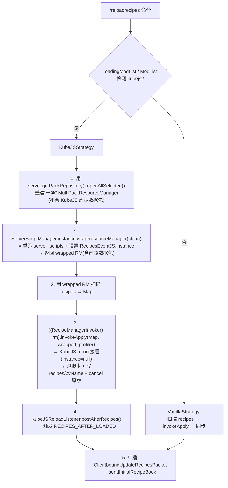
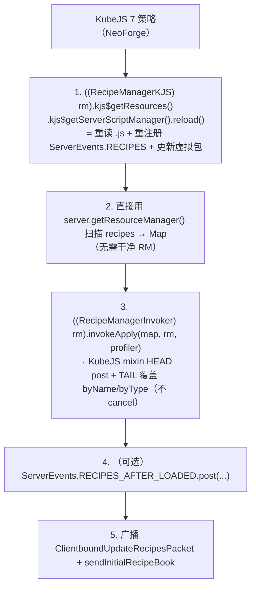

# ReloadOnlyRecipes 设计文档

> 目标平台：**Minecraft 1.20.1 / Forge**
> 一句话目标：提供一条指令 `/reloadrecipes`，**只重载配方（recipes）**，避免完整 `/reload` 在复杂整合包环境下的巨大开销；并**兼容 KubeJS** 的运行时配方修改。
> 工程约束：**避免使用 Java 反射（`java.lang.reflect`），优先使用带判断的 Mixin + 软依赖（`modCompileOnly`）。**

---

## 1. 背景：为什么完整 `/reload` 慢

`/reload` 会重建整个 `ReloadableServerResources`：

- **重新打开所有数据包**（原版 + 每个 mod 的 jar + 世界 `datapacks/`）。
- **重新触发每一个** `PreparableReloadListener`：配方、战利品表、进度、谓词、函数、物品修饰器，以及所有 mod 通过 `AddReloadListenerEvent` 注册的监听器。

配方只是其中一个监听器，但你被迫等全部跑完。整合包越大（mod / 数据包越多），瓶颈越明显。

---

## 2. 核心原理：`RecipeManager` 是独立的 reload listener

`RecipeManager` 本身是一个独立的 `SimpleJsonResourceReloadListener`（构造时 `super(GSON, "recipes")`）：

- `prepare` 扫描 `data/*/recipes/**.json`。
- `apply` 用扫描结果**整体重建**配方表。

因此只需单独跑它这一个监听器、再把结果同步给客户端，即可绕过其它所有监听器。已核对 Forge 1.20.1 官方 patch 确认：

- `RecipeManager.apply`（SRG `m_5787_`）是 `protected`。
- Forge 版 `apply` 内含条件配方处理 `CraftingHelper.processConditions`，且 `context` 是实例字段——**必须调用实例自己的 `apply`**。
- 玩家登录与 `PlayerList.reloadResources()` 都用 `new ClientboundUpdateRecipesPacket(server.getRecipeManager().getRecipes())` 下发配方。

---

## 3. 基础方案（无 KubeJS）：Vanilla 策略

三步：

1. **扫描并解析** `data/<ns>/recipes/**.json` → `Map<ResourceLocation, JsonElement>`（`FileToIdConverter.json("recipes")` 递归扫描 `ResourceManager` 中所有已加载 pack）。
2. **重建配方表**：调用 `recipeManager.apply(map, resourceManager, InactiveProfiler.INSTANCE)`。
3. **同步客户端**：广播 `ClientboundUpdateRecipesPacket(recipeManager.getRecipes())` + 每个玩家 `getRecipeBook().sendInitialRecipeBook(player)`。

> 客户端收到 `ClientboundUpdateRecipesPacket` 会触发 `RecipesUpdatedEvent`，JEI/REI 自动刷新。

### `apply` 的访问方式（不用反射、不用 AT）

`apply` 是 `protected`。**用 Mixin `@Invoker` 生成一个公开桥**（运行时经 refmap 映射到 SRG，零反射）：

```java
@Mixin(RecipeManager.class)
public interface RecipeManagerInvoker {
    @Invoker("apply")
    void reloadonlyrecipes$invokeApply(
        Map<ResourceLocation, JsonElement> map,
        ResourceManager resourceManager,
        ProfilerFiller profiler);
}
```

调用：`((RecipeManagerInvoker) recipeManager).reloadonlyrecipes$invokeApply(map, rm, InactiveProfiler.INSTANCE);`

---

## 4. 其它 mod 配方的行为分析

配方在 1.20.1 / 1.21.1 都是**纯数据驱动**的，据此区分两类来源：

### 4.1 会被完整重载的（✅）

所有以 **JSON** 形式存在的配方（原版、mod jar 内置 `data/<modid>/recipes/`、世界数据包）。因为 `listMatchingResources` 递归扫描所有 pack，`apply` 用完整 map 整体重建。包含 Create / Mekanism 等自定义 `RecipeType` 的嵌套子目录配方。`RecipeType` / `RecipeSerializer` 是启动期注册的，不受影响。

### 4.2 运行时代码注入/修改配方的 mod —— 两种介入方式

| 类型 | 代表 | 介入方式 | 我们调用 `apply` 时 |
|---|---|---|---|
| **A 类** | **KubeJS** | Mixin 注入 `RecipeManager.apply` | **自动触发**（mixin 就挂在 `apply` 上） |
| **B 类** | **CraftTweaker** | `AddReloadListenerEvent` 注册独立 listener | **不触发**（不在 `apply` 链上） |

- 完整 `/reload` 的监听器链（已核对 `ReloadableServerResources` patch）：原版 listeners（含 `RecipeManager`）+ 平台事件收集的 B 类监听器——Forge 经 `ForgeEventFactory.onResourceReload()` post `AddReloadListenerEvent`，NeoForge 经等价的 `AddReloadListenerEvent`（`net.neoforged.neoforge.event.*`）。两版机制一致，B 类监听器都不在 `apply` 链上。
- **A 类**天然兼容：我们本就要调 `apply`，KubeJS mixin 会被触发。
- **B 类**默认不覆盖：其 listener 不在 `apply` 链上，只调 `apply` 会**抹掉**它们的运行时修改。若要兼容需另行触发（见 §9 未来扩展）。

---

## 5. KubeJS 兼容方案（核心 · 6/7 版本化）

> KubeJS 6（分支 `2001`，Forge 1.20.1）与 KubeJS 7（分支 `2101`，NeoForge 1.21.1）**两代 API 完全不同**，兼容层必须版本化（整类隔离 + Stonecutter `//? if`）。§5.1–§5.4 为 6 代（Forge）原理与流程；§5.5 为 7 代（NeoForge）差异；§5.6 为版本化落地。两代差异一手核实见 [loader-platform-api §6](references/loader-platform-api.md)。

### 5.1 KubeJS 6 架构（Forge，已核对分支 `2001` 源码）

- `RecipeManagerMixin`：`@Inject(method = "apply*", at = @At("HEAD"), cancellable = true)`。逻辑：

  ```java
  if (ServerEvents.RECIPES.hasListeners()) {
      if (RecipesEventJS.instance != null) {
          RecipesEventJS.instance.post(this, map); // 跑用户脚本 + 直接写 recipeManager.recipes/byName
          RecipesEventJS.instance = null;
          ci.cancel();                             // 吃掉原版逻辑
      } else {
          // "falling back to vanilla"
      }
  }
  ```

- `RecipesEventJS.instance` 在 `ServerScriptManager.wrapResourceManager()` **末尾**设置——**发生在"重新执行 server scripts"之后**：

  ```java
  // wrapResourceManager(...) 内部末尾：
  reload(wrappedResourceManager);                 // 重跑 server_scripts，重注册 ServerEvents.recipes
  ...
  if (ServerEvents.RECIPES.hasListeners()) {
      RecipesEventJS.instance = new RecipesEventJS();
  }
  ```

- 收尾：`KubeJSReloadListener.postAfterRecipes()` 触发 `RECIPES_AFTER_LOADED`。
- KubeJS **完全靠 mixin**（`ReloadableServerResourcesMixin` 构造→`updateResources`；`inject_resources/MinecraftServerMixin`→`wrapResourceManager`），**不用** `AddReloadListenerEvent`。

### 5.2 兼容核心洞察

KubeJS 的 mixin 挂在 `apply` 上，我们调 `apply` 就会触发；**唯一障碍**是"只重载配方"场景下 `RecipesEventJS.instance == null`（上次 reload 后被置 null），导致回落原版、丢失脚本配方。

> **兼容 = 在调用 `apply` 前，复现"重新加载 server scripts → 设置 `instance`"这一步。** 之后 `apply` 内的 KubeJS mixin 自然接管。而这一步正是 `ServerScriptManager.wrapResourceManager()` 的核心工作。

### 5.3 兼容流程



### 5.4 关键坑：资源管理器重复包装

`wrapResourceManager` 会往 pack 列表塞 KubeJS 的 `VirtualKubeJSDataPack`。而 `server.getResourceManager()` **已经是上次被 KubeJS 包装过的产物**，直接再传会**重复叠加虚拟包**。

**缓解（零反射、零额外 mixin）**：用公开 API 从 `PackRepository` 重建一个"干净"的 manager（虚拟包是运行时加的，不在 `PackRepository` 里）：

```java
CloseableResourceManager clean = new MultiPackResourceManager(
    PackType.SERVER_DATA,
    server.getPackRepository().openAllSelected());
// 用完注意 close()，避免文件句柄泄漏
```

> **实现落点**：Forge 侧 `KubeJs6RecipeReloadStrategy`（`compat/kubejs/`）。真实流程 = `CleanServerResources.openClean(server)` → `ServerScriptManager.instance.wrapResourceManager(clean)` → 扫描 wrapped RM → `invokeApply` → `KubeJSReloadListener.postAfterRecipes()`，`finally { clean.close(); }`。

### 5.5 KubeJS 7 差异（NeoForge，已核对分支 `2101` 源码）

7 代重写了 KubeJS 的配方注入，**与 6 代机制不同**（[loader-platform-api §6.2](references/loader-platform-api.md) 一手核实）：

| 维度 | KubeJS 6（Forge `2001`） | KubeJS 7（NeoForge `2101`） |
|---|---|---|
| `apply` mixin | `@At("HEAD") cancellable`，处理后 **`ci.cancel()`** 吃掉原版 | HEAD `post` + **TAIL `finishEvent()` 覆盖**，**不 cancel**（容错设计） |
| 开关 | 静态字段 `RecipesEventJS.instance`（reload 后置 null） | 实例 duck `RecipeManagerKJS.kjs$getResources()`，**每次 `ReloadableServerResources` 构造时绑定、复用持久有效** |
| 重跑脚本入口 | `ServerScriptManager.wrapResourceManager(clean)`（内部重跑 + 设 `instance`） | `((RecipeManagerKJS) rm).kjs$getResources().kjs$getServerScriptManager().reload()`（public） |
| 干净 RM | **需要**（`wrapResourceManager` 会叠加虚拟包，须用 `PackRepository` 重建，见 §5.4） | **不需要**（虚拟包已在当前 `server.getResourceManager()`，`reload()` 只更新内容不重复插入）→ 直接用 `server.getResourceManager()` 扫描 |
| 收尾 | `KubeJSReloadListener.postAfterRecipes()`（静态方法） | 无静态方法；`RECIPES_AFTER_LOADED` 由 `ResourceManagerReloadListener` 触发，只重载配方**可选**手动 post（多数场景无需） |

**7 代兼容流程**：



> **实现落点**：NeoForge 侧 `KubeJs7RecipeReloadStrategy`（`compat/kubejs/`）。真实流程 = `kjs$getResources().kjs$getServerScriptManager().reload()` → `RecipeScanner.scan(server.getResourceManager())` → `invokeApply`（无干净 RM、无 `postAfterRecipes`）。

### 5.6 版本化落地（Stonecutter）

两代兼容代码放独立平级实现类（`KubeJs6RecipeReloadStrategy` / `KubeJs7RecipeReloadStrategy`），各自的 KubeJS 类引用用 `//? if forge {` / `//?} else {` 隔离，未激活节点整段注释、不参与编译。选择由 `RecipeReloadService.pick()` 在运行时按 `ModList.isLoaded("kubejs")` + 平台决定（Forge→6 代、NeoForge→7 代、否则 Vanilla），并**类隔离**加载（无 KubeJS 时永不链接，避免 `NoClassDefFoundError`）。详见 [loader-platform-api §6.3/§7](references/loader-platform-api.md)。

---

## 6. 工程架构：避免反射 + 带判断的 Mixin

| 需要访问的目标 | ❌ 旧（反射/AT） | ✅ 新方案 |
|---|---|---|
| MC `RecipeManager.apply`（protected） | AT 或反射 | **Mixin `@Invoker`**（refmap 映射，零反射） |
| KubeJS `ServerScriptManager` / `KubeJSReloadListener`（public，软依赖） | 反射 | **`modCompileOnly` 软依赖 + `ModList` 判断 + 类隔离**，直接调用 |
| 是否加载 KubeJS 相关兼容代码 | 运行时反射探测 | **Mixin Config Plugin `shouldApplyMixin()` 带判断** + 类隔离 |
| “干净”资源管理器 | 反射取 pack 列表 | **`PackRepository.openAllSelected()` 公开 API** |

### 6.1 软依赖（`build.gradle`）

```groovy
dependencies {
    // 编译期可见、运行时可选；不打包进产物
    modCompileOnly "dev.latvian.mods:kubejs-forge:2001.6.x-build.xxx"
}
```

### 6.2 类隔离（避免 `NoClassDefFoundError`，非反射）

所有**直接引用 KubeJS 类**的代码，隔离在独立类 `KubeJSRecipeReloadStrategy` 中。仅当 `ModList.get().isLoaded("kubejs")` 为真时才实例化它——JVM 此时才会链接这些类。没装 KubeJS 时永不加载，安全。

### 6.3 带判断的 Mixin Config Plugin

用于**条件启用**任何 mixin（尤其未来若需 mixin 其它 mod 的类）。判断在 mixin 极早期阶段，**用 `LoadingModList`（此阶段 `ModList` 尚不可用）**：

```java
public class ReloadOnlyRecipesMixinPlugin implements IMixinConfigPlugin {
    @Override
    public boolean shouldApplyMixin(String targetClassName, String mixinClassName) {
        // 约定：kubejs 兼容用的 mixin 放在 *.mixin.compat.kubejs.* 包下
        if (mixinClassName.contains(".compat.kubejs.")) {
            return net.minecraftforge.fml.loading.LoadingModList.get()
                       .getModFileById("kubejs") != null;
        }
        return true;
    }
    // 其余方法留空实现
    @Override public void onLoad(String mixinPackage) {}
    @Override public String getRefMapperConfig() { return null; }
    @Override public void acceptTargets(Set<String> a, Set<String> b) {}
    @Override public List<String> getMixins() { return null; }
    @Override public void preApply(String t, ClassNode n, String m, IMixinInfo i) {}
    @Override public void postApply(String t, ClassNode n, String m, IMixinInfo i) {}
}
```

> 注：当前 KubeJS 兼容**不需要**我们 mixin 到 KubeJS 的类（其关键成员均为 public，`modCompileOnly` 直接调即可）。此 plugin 主要为 (a) 把 KubeJS 相关的 duck-interface/invoker mixin 限定为"仅当 kubejs 加载时启用"，(b) 未来兼容其它 A 类 mod 预留。

### 6.4 为什么不用反射

- 反射对混淆名/SRG 敏感，需 `ObfuscationReflectionHelper`，易随版本破裂。
- 反射绕过编译期类型检查，重构不安全。
- Mixin `@Invoker`/`@Accessor` + refmap 是 modding 原生方式，编译期类型安全、运行时自动映射。
- 软依赖直接调用 public API，可读性与安全性最佳。

---

## 7. 关键代码骨架

> 仅为设计骨架，落地时再补全 import、异常处理、日志、i18n。

### 7.1 命令注册

```java
@Mod.EventBusSubscriber
public final class ModEvents {
    @SubscribeEvent
    static void onRegisterCommands(RegisterCommandsEvent e) {
        e.getDispatcher().register(Commands.literal("reloadrecipes")
            .requires(s -> s.hasPermission(2))
            .executes(ctx -> {
                RecipeReloadStrategy.pick().reload(ctx.getSource().getServer());
                ctx.getSource().sendSuccess(() ->
                    Component.literal("Recipes reloaded"), true);
                return 1;
            }));
    }
}
```

### 7.2 策略接口 + 选择（软依赖类隔离）

```java
public interface RecipeReloadStrategy {
    void reload(MinecraftServer server) throws Exception;

    static RecipeReloadStrategy pick() {
        if (ModList.get().isLoaded("kubejs")) {
            return new KubeJSRecipeReloadStrategy(); // 仅此时链接 KubeJS 类
        }
        return new VanillaRecipeReloadStrategy();
    }
}
```

### 7.3 Vanilla 策略

```java
final class VanillaRecipeReloadStrategy implements RecipeReloadStrategy {
    private static final Gson GSON = new GsonBuilder().setLenient().create();

    public void reload(MinecraftServer server) {
        RecipeManager rm = server.getRecipeManager();
        ResourceManager resources = server.getResourceManager();

        Map<ResourceLocation, JsonElement> map = scan(resources);
        ((RecipeManagerInvoker) rm)
            .reloadonlyrecipes$invokeApply(map, resources, InactiveProfiler.INSTANCE);
        RecipeSync.toAllClients(server, rm);
    }

    static Map<ResourceLocation, JsonElement> scan(ResourceManager rm) {
        Map<ResourceLocation, JsonElement> map = new HashMap<>();
        FileToIdConverter conv = FileToIdConverter.json("recipes");
        for (var e : conv.listMatchingResources(rm).entrySet()) {
            try (Reader r = e.getValue().openAsReader()) {
                map.put(conv.fileToId(e.getKey()),
                        GsonHelper.fromJson(GSON, r, JsonElement.class));
            } catch (Exception ex) { /* log & skip */ }
        }
        return map;
    }
}
```

### 7.4 KubeJS 策略（直接调用 public API，零反射）

```java
final class KubeJSRecipeReloadStrategy implements RecipeReloadStrategy {
    public void reload(MinecraftServer server) {
        RecipeManager rm = server.getRecipeManager();

        // 0) 干净 RM（避免重复叠加 KubeJS 虚拟包）
        CloseableResourceManager clean = new MultiPackResourceManager(
            PackType.SERVER_DATA, server.getPackRepository().openAllSelected());
        try {
            // 1) 重跑 server_scripts + 设置 RecipesEventJS.instance
            ResourceManager wrapped =
                ServerScriptManager.instance.wrapResourceManager(clean);

            // 2) 用 wrapped 扫描配方
            Map<ResourceLocation, JsonElement> map =
                VanillaRecipeReloadStrategy.scan(wrapped);

            // 3) invokeApply → KubeJS RecipeManagerMixin 在 HEAD 接管
            ((RecipeManagerInvoker) rm)
                .reloadonlyrecipes$invokeApply(map, wrapped, InactiveProfiler.INSTANCE);

            // 4) KubeJS 收尾事件
            KubeJSReloadListener.postAfterRecipes();
        } finally {
            clean.close(); // 释放句柄
        }

        // 5) 同步客户端
        RecipeSync.toAllClients(server, rm);
    }
}
```

### 7.5 客户端同步

```java
final class RecipeSync {
    static void toAllClients(MinecraftServer server, RecipeManager rm) {
        var packet = new ClientboundUpdateRecipesPacket(rm.getRecipes());
        for (ServerPlayer p : server.getPlayerList().getPlayers()) {
            p.connection.send(packet);
            p.getRecipeBook().sendInitialRecipeBook(p);
        }
    }
}
```

### 7.6 Mixin 资源

- `mixins.reloadonlyrecipes.json`：注册 `RecipeManagerInvoker`，`plugin` 指向 `ReloadOnlyRecipesMixinPlugin`。
- `RecipeManagerInvoker` 为无条件 mixin（MC 类一定存在）。

---

## 8. 风险与边界

1. **资源管理器重复包装（最需注意）**：务必用 `PackRepository.openAllSelected()` 重建干净 manager 传给 `wrapResourceManager`，并在 `finally` 中 `close()`。
2. **强耦合 KubeJS 内部实现**：6 代 `wrapResourceManager` / `RecipesEventJS.instance` / `postAfterRecipes`、7 代 `kjs$getResources().kjs$getServerScriptManager().reload()` 均属内部实现，非稳定 API，**KubeJS 大版本更新可能失效**。已按 `kubejs` 版本做适配层（6 代 `KubeJs6RecipeReloadStrategy` / 7 代 `KubeJs7RecipeReloadStrategy`）；兼容策略抛异常时由 `RecipeReloadService` 回落 Vanilla 策略并告警。
3. **B 类 mod（CraftTweaker 等）不被覆盖**：其 `AddReloadListenerEvent` listener 不在 `apply` 链上，本方案不触发。纯改 JSON 配方场景不受影响；若依赖其脚本改配方，需用它自带的重载。
4. **只重载配方，不重载 tags / loot / advancement**：若配方依赖的 `tag` 也改了，需连标签一起重载。
5. **性能**：KubeJS 策略会重跑脚本 + 重建 `MultiPackResourceManager`，比纯 Vanilla 重，但仍远小于完整 `/reload`（不碰 loot/advancement/function/tags 及其它 listener）。
6. **`server.getResourceManager()` 的实时性**：对文件夹型数据包实时读盘；zip / mod-jar 内置配方可能读旧句柄（Vanilla 策略）。KubeJS 策略用 `openAllSelected()` 重新打开，实时性更好。

---

## 9. 未来扩展

- **B 类 mod 兼容（可选）**：在 `apply` 后，另行 post `AddReloadListenerEvent` 并只跑与配方相关的 listener（会部分接近完整 reload，需权衡）。
- **其它 A 类 mod**：任何 mixin 注入 `apply` 的 mod 都会被我们的 `invokeApply` 自然触发，通常无需特殊处理；若有前置状态需求，仿 KubeJS 用"带判断的 mixin + 软依赖"处理。
- **更稳妥的长期路线**：向 KubeJS 提 PR 增加公开的"只重载配方"入口；本 mod 定位为"无 KubeJS 时的纯 JSON 配方快速重载，有 KubeJS 时委托其脚本子流程"。

---

## 10. 关键 API 参考（Forge 1.20.1 SRG / NeoForge 1.21.1 Mojmap）

**SRG 仅 Forge 1.20.1 运行时需要**；NeoForge 1.21.1 运行时是 Mojmap（名即官方名，无 SRG）。Mixin `@Invoker` 两版共用同一接口，Loom refmap 各自映射（详见 [loader-platform-api §2](references/loader-platform-api.md)）。

| 成员 | 官方名（两版通用） | Forge 1.20.1 SRG |
|---|---|---|
| `RecipeManager#apply` | `apply` | `m_5787_` |
| `RecipeManager#getRecipes` | `getRecipes` | `m_44051_` |
| `MinecraftServer#getRecipeManager` | `getRecipeManager` | `m_129894_` |
| `PlayerList#broadcastAll` | `broadcastAll` | `m_11268_` |

其它公开 API（两版通用）：`MinecraftServer#getResourceManager`、`MinecraftServer#getPackRepository`、`PackRepository#openAllSelected`、`FileToIdConverter#json/listMatchingResources/fileToId`、`ClientboundUpdateRecipesPacket(Collection)`、`ServerRecipeBook#sendInitialRecipeBook`、`InactiveProfiler#INSTANCE`。配方对象两版不同（Forge `Recipe<?>` / NeoForge `RecipeHolder<?>`），但我们只把 JSON map 交给 `apply`、不直接触碰。

KubeJS（`modCompileOnly`）：
- **6 代（Forge，分支 `2001`）**：`dev.latvian.mods.kubejs.server.ServerScriptManager#instance / #wrapResourceManager(CloseableResourceManager)`、`dev.latvian.mods.kubejs.server.KubeJSReloadListener#postAfterRecipes()`、`dev.latvian.mods.kubejs.recipe.RecipesEventJS#instance`。
- **7 代（NeoForge，分支 `2101`）**：`dev.latvian.mods.kubejs.core.RecipeManagerKJS#kjs$getResources()`、`ReloadableServerResourcesKJS#kjs$getServerScriptManager()`、`dev.latvian.mods.kubejs.server.ServerScriptManager#reload()`。

---

## 11. 待办 / 下一步

- [ ] 搭建 Forge 1.20.1 MDK（`build.gradle`、`gradle.properties`、`settings.gradle`、`mods.toml`、主类）。
- [ ] 加入 Mixin 配置（`RecipeManagerInvoker` + `ReloadOnlyRecipesMixinPlugin`）。
- [ ] 实现 `RecipeReloadStrategy` / `VanillaRecipeReloadStrategy` / `KubeJSRecipeReloadStrategy` / `RecipeSync`。
- [ ] 注册 `/reloadrecipes` 命令。
- [ ] `modCompileOnly` 接入 KubeJS，验证 KubeJS 策略端到端。
- [ ] 实测：无 KubeJS / 有 KubeJS 两种环境；文件夹与 zip 数据包；JEI/REI 刷新；重复包装与句柄释放。

> **当前状态：设计已定稿并记录本文件，等待下一步实现指令。**
