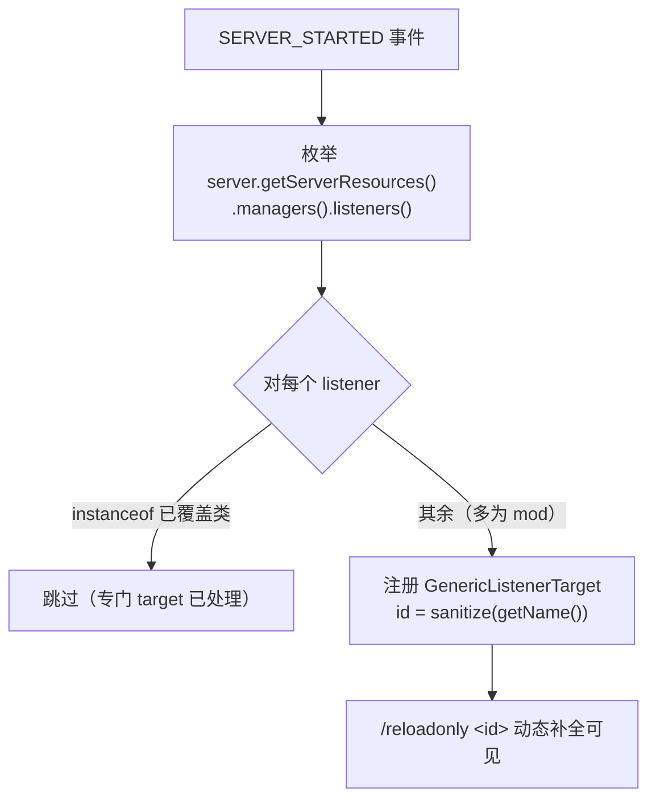
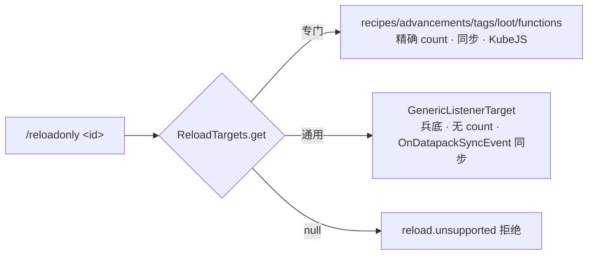
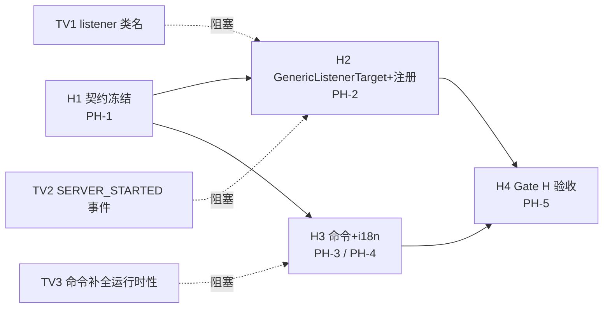

# 阶段 H · 通用兜底重载（Generic Fallback Reload）· 计划

> 归属：`feature/reload-only-data` 分支的**增量特性**，是 [reload-only-data-design.md](../reload-only-data-design.md) §11 的延伸。
> 目标：在已落地的 5 个专门 target（recipes / advancements / tags / loot / functions）之上，新增**通用兜底**能力——让 `/reloadonly <name>` 支持**任意** `PreparableReloadListener`，包括**第三方 mod 通过 `AddReloadListenerEvent` 注册的**数据类型。
> 方法遵循 `parallel-task-planning`：设计（核实事实）→ 里程碑/WBS → 平行任务 → 门控验收。

---

## 0. 需求与非目标

**需求（用户）**：
- **特殊类型 + Tag 保留专门处理**：recipes（KubeJS）、advancements（玩家进度重算+同步）、tags（per-registry + 客户端同步 + ingredient 提示）、loot（1.21 registry 替换）、functions（`replaceLibrary` 重注册命令）—— 维持现状不动。
- **其他类型走通用处理**：凡未被专门 target 覆盖的 listener（**主要是 mod 加的**），用一套通用机制重载。

**非目标（本阶段不做）**：
- 不为通用 target 做精确条数统计（各 listener 内部结构不一，无法通用计数）——用户已确认接受。
- 通用 target 的客户端同步走 **`OnDatapackSyncEvent`**（Forge/NeoForge 标准 mod 同步钩子，见 §2.5）——尽力而为：对实现了该钩子的 mod 有效，不保证覆盖用完全私有网络的 mod。
- 不改动 5 个专门 target 的既有行为（零回归）。
- 不支持 B 类 datapack registries（它们不是 listener，本就排除）。

---

## 1. 核实事实（`verified` via javap，2026-07-07）

| # | 事实 | 证据 |
|---|---|---|
| V1 | `ReloadableServerResources.listeners()` 两版均 **public**，返回 `List<PreparableReloadListener>` | javap 两版签名一致 |
| V2 | `PreparableReloadListener.reload(PreparationBarrier, ResourceManager, ProfilerFiller×2, Executor×2):CompletableFuture<Void>` + `default String getName()` 两版一致 | javap 接口 |
| V3 | **1.20.1** vanilla `listeners()` = `[LootDataManager, TagManager, ServerFunctionLibrary, RecipeManager, ServerAdvancementManager]`（构造函数 `new` 顺序） | javap `-c <init>` |
| V4 | **1.21.1** vanilla `listeners()` = `[TagManager, RecipeManager, ServerFunctionLibrary, ServerAdvancementManager]`（**loot 不在**，已 registry 化） | PA-2 §5 + LootReload 代码印证 |
| V5 | `AddReloadListenerEvent`（Forge `net.minecraftforge.event` / NeoForge `net.neoforged.neoforge.event`）有 `addListener(PreparableReloadListener)` + `getListeners()`；**mod 加的 listener 进入 `listeners()`** | javap 两版同构 |
| V6 | `server.getServerResources().managers()`（`ReloadableServerResources`）两版通用（functions 已在用） | PF-1 落地 |
| V7 | `PlayerList.reloadResources()` 两版 public。**1.20.1 轻**：发 `ClientboundUpdateTagsPacket` + `ClientboundUpdateRecipesPacket` + 触发 `OnDatapackSyncEvent`；**1.21.1 重**：重建 `ServerGamePacketListenerImpl` + 重发 Login/Recipes/PlayerInfo 等（近乎玩家重新初始化）——**太重，不适合选择性重载** | javap `-c` |
| V8 | **`OnDatapackSyncEvent`**（Forge `net.minecraftforge.event` / NeoForge `net.neoforged.neoforge.event`）构造 `(PlayerList, ServerPlayer)`，`player=null` 表全体（`getPlayers()`/`getRelevantPlayers()` 返回所有在线）；是 **mod 同步自定义 datapack 数据到客户端的标准钩子**（vanilla `/reload` 也触发它）。可手动 `EVENT_BUS.post` 触发 | javap 两版同构 |
| V9 | **无 per-type 客户端同步入口**：event 包仅 `AddReloadListenerEvent`+`OnDatapackSyncEvent`(全量)+`TagsUpdatedEvent`(接收侧)；客户端 `ClientPacketListener` 的 datapack 接收是 **hardcoded per-type**(`handleUpdateRecipes`/`handleUpdateTags`/`handleUpdateAdvancementsPacket`，正好对应三个专门 target)，**无通用“接收任意数据并 apply”入口** | ZipFile + javap ClientPacketListener |
| V10 | **可序列化 + 落地**：`SimpleJsonResourceReloadListener.prepare()` 产 `Map<ResourceLocation, JsonElement>`(原始 JSON，**可通用序列化**)、`directory` 可 `@Accessor`。Architectury `NetworkManager` 两版通用：`registerReceiver(s2c(), channel, receiver)`+`sendToPlayers(players, channel, FriendlyByteBuf)`+`canPlayerReceive(player, channel)`(判客户端是否装本 mod) | javap SimpleJson + architectury NetworkManager |

**推论（架构关键）**：vanilla 的 5 个 listener **已全部被现有专门 target 覆盖**。因此通用兵底在**纯 vanilla 下无覆盖对象**，其**实际价值 = 覆盖第三方 mod 通过 `AddReloadListenerEvent` 注册的 listener**（如某 mod 的自定义 JSON 数据加载器）。

**同步推论（回应决策 ②）**：通用客户端同步**可行**——不用 `reloadResources()`（1.21.1 太重），而是只 `post` 一个 `OnDatapackSyncEvent(playerList, null)`：mod 在自己的监听器里同步各自数据，我们无需知道它们发什么包。

**待核实（`to-verify`，实现前逐项核实，写回本表）**：
| # | 事项 | 影响 |
|---|---|---|
| TV1 | 5 个专门 listener 的**类全限定名**（用于 Class 匹配跳过；1.21.1 `ServerAdvancementManager` 包可能变） | TH2.2 枚举跳过 |
| TV2 | 动态注册时机事件：Architectury `LifecycleEvent.SERVER_STARTED`（跨平台）能否拿到 `MinecraftServer` 且此时 `managers().listeners()` 已就绪 | TH2.3 |
| TV3 | 现有 `ModCommands` 的 `<target>` 补全是否**运行时**查 `ReloadTargets.ids()`（动态注册的 target 才能出现在补全） | TH3.1 |
| TV4 | `getName()` 实际返回值（vanilla listener 多为 `SimpleJsonResourceReloadListener` 默认=`directory`；mod listener 自定义）——决定通用 id 的可读性与规范化规则 | TH1.1 |

---

## 2. 方案与架构

### 2.1 核心：`GenericListenerTarget`

一个 `ReloadTarget` 实现，**包装单个** `PreparableReloadListener`，重载走**统一完整协议**（复用 loot/functions 已验证的 `Runnable::run` 死锁避免法）。**两版通用、无 `//? if`、无 mixin**（`listeners()`/`reload()` 皆 public）。

```java
public final class GenericListenerTarget implements ReloadTarget {
    private final PreparableReloadListener listener;
    private final String id;                       // sanitize(listener.getName())

    @Override public int reload(MinecraftServer server, String arg) {
        var barrier = new PreparableReloadListener.PreparationBarrier() {
            @Override public <T> CompletableFuture<T> wait(T v) {
                return CompletableFuture.completedFuture(v);
            }
        };
        listener.reload(barrier, server.getResourceManager(),
            InactiveProfiler.INSTANCE, InactiveProfiler.INSTANCE,
            Util.backgroundExecutor(), Runnable::run).join();   // 主线程就地执行避死锁
        return -1;                                  // 约定：-1 = 未知条数
    }
    @Override public boolean needsClientSync() { return true; }    // 见 §2.5：触发 OnDatapackSyncEvent
    @Override public void sync(MinecraftServer server, String arg) {
        GenericSync.fireDatapackSync(server);      // 两版隔离（//? if 事件总线）
    }
    @Override public boolean affectedByKubeJS() { return false; }
    @Override public boolean isGeneric() { return true; }          // 新契约位（见 §3）
    @Override public Component postHint(MinecraftServer s, String a) {
        return Component.translatable("...reload.generic.hint");    // 同步范围/依赖提示
    }
}
```

### 2.2 识别策略：**Class 匹配跳过**（不依赖 getName 字符串）

专门 target 已覆盖的 listener 用**类**识别（比 `getName()` 字符串稳健）。维护一个"已覆盖 listener 类"集合，枚举 `listeners()` 时 `instanceof` 命中即跳过：

- `RecipeManager`、`ServerAdvancementManager`、`TagManager`、`ServerFunctionLibrary`、`LootDataManager`（1.20.1）。
- 其余 listener → 建 `GenericListenerTarget`。

> Tag 的特殊性（用户强调）：`TagManager` 在 `listeners()` 里且是依赖链最上游，**必须跳过**——它由专门 `TagsTarget` 做 per-registry + 客户端同步；通用重载 TagManager 会全量重载但不发同步包、破坏依赖，语义不完整。

### 2.3 动态注册（server 启动后）

`listeners()` 需 server 运行时才有值 → 在 **SERVER_STARTED** 事件枚举、注册通用 target（每次重启先清空通用区，避免累积）。



### 2.4 分层分发（与现有门面完全兼容）

`ReloadService` / `ModCommands` **不改核心逻辑**：`ReloadTargets.get(id)` 命中专门 target 就精确处理，命中通用 target 就走 `GenericListenerTarget`。命令层仅需按 `isGeneric()` 切换反馈文案（无条数 + 提示）。



### 2.5 通用客户端同步：三层策略（决策 ② 深化）

研究表明客户端**无通用 apply 入口**（V9：接收 hardcoded per-type），故“精确单类型同步”按可行性分三层降级：

| 层 | 适用 | 机制 | 精度 |
|---|---|---|---|
| **L1 精确包（opt-in）** | mod 注册了本 mod 的 sync handler | 自定义包 `reloadonlydata:generic_sync`（typeId + payload），客户端查注册表 apply（见 §2.6） | 精确单类型 |
| **L2 全量事件** | 挂了 `OnDatapackSyncEvent` 的 mod | `post OnDatapackSyncEvent(playerList, null)` | 全量（所有挂钩子 mod） |
| **L3 不同步** | 前两者都不适用 | 仅 `generic.hint` 提示手动 `/reload` | — |

通用 target 的 `sync()` 按序：typeId ∈ L1 注册表且 `canPlayerReceive` → 发精确包；否则 → L2 全量事件（默认）或 L3（可配）。

> **vanilla 5 类不在此列**：recipes/tags/advancements 由专门 target 直接构造 vanilla 包（`ClientboundUpdateRecipesPacket` 等 → 客户端 hardcoded `handleUpdate*` 应用）——**这本就是“直接调用他们的实现”**，精确、已落地；loot/functions 纯服务端无需同步。

#### L2 详述：`OnDatapackSyncEvent`（全量兜底）

**核实（V7/V8）**：`OnDatapackSyncEvent` 是 Forge/NeoForge 在 `/reload` 同步客户端时触发的标准事件，**mod 在其监听器里同步自己的自定义 datapack 数据**。因此通用 target 的 `sync()` 只需手动 `post` 一个 `OnDatapackSyncEvent(playerList, null)`（`null`=全体在线），即可驱动**所有正确实现了该钩子的 mod** 各自同步——**无需知道每个 mod 发什么包**。

```java
// reload/sync/GenericSync.java —— sync 部分需 //? if（事件总线 + 包名两版不同），reload 主体仍两版通用
public static void fireDatapackSync(MinecraftServer server) {
    //? if forge {
    /*net.minecraftforge.common.MinecraftForge.EVENT_BUS.post(
        new net.minecraftforge.event.OnDatapackSyncEvent(server.getPlayerList(), null));
    *///?} else {
    net.neoforged.neoforge.common.NeoForge.EVENT_BUS.post(
        new net.neoforged.neoforge.event.OnDatapackSyncEvent(server.getPlayerList(), null));
    //?}
}
```

- **为何不用 `PlayerList.reloadResources()`**：1.20.1 轻（tags+recipes+event），但 **1.21.1 太重**（重建 packet listener、近乎玩家重新初始化），违背“选择性重载省开销”的初衷。只 `post` 事件更精准轻量。
- **覆盖范围**：对实现了 `OnDatapackSyncEvent` 监听器的 mod 有效（多数数据驱动 mod 如此）；用完全私有网络、不挂此事件的 mod 仍不覆盖 → `generic.hint` 如实告知。
- **⚠️ 同步粒度 = 全量（重要）**：`OnDatapackSyncEvent` 构造 `(PlayerList, ServerPlayer)` **不携带“哪个 listener 变了”**，各 mod 监听器收到后**无差别地把各自全部数据重发**。故触发它 = **所有挂钩子的 mod 全量重新同步客户端**，而非只同步我们重载的那一个。**权衡可接受**：① 客户端同步是发包（网络），远比服务端“重读所有数据包”（磁盘 IO + 解析）轻——省的是**服务端**重载开销，核心价值仍在；② 与 vanilla `/reload` 的客户端同步行为一致（它也全量触发）；③ 精确只同步单个通用 listener 需该 mod 私有 API，通用够不到（这正是“专门 target 精确 / 通用 target 全量兜底”分层的由来）。**若在意**：可让通用 target 不自动 sync（`needsClientSync=false` + 提示），或加 `sync` 开关（默认全量、可关）。
- **不重复处理 vanilla**：recipes/tags/advancements 已由专门 target 精确同步；通用同步只补 mod 侧。

### 2.6 L1 详述：自定义同步包 + handler 注册表（opt-in 精确同步）

用户设计“typeId + 客户端找 handler”完全可落地——**关键是 handler 由 mod 提供**（V9：客户端无通用 apply 入口，只有 mod 知道自己的客户端容器怎么更新）。

```java
// 1. 注册表（mod 在两端各注册一半）
GenericSyncRegistry.register(
    String typeId,                                                       // 与 listener 匹配的类型标识
    BiConsumer<PreparableReloadListener, FriendlyByteBuf> serverWriter,  // 服务端：序列化
    Consumer<FriendlyByteBuf> clientApplier);                            // 客户端：反序列化 + 应用到客户端容器

// 2. 自定义包 channel = reloadonlydata:generic_sync（Architectury NetworkManager，两版通用）
//    payload = [typeId][mod 写的 bytes]

// 3. 通用 target.sync()：
if (GenericSyncRegistry.has(typeId) && NetworkManager.canPlayerReceive(p, CHANNEL)) {
    var buf = new FriendlyByteBuf(Unpooled.buffer());
    buf.writeUtf(typeId);
    GenericSyncRegistry.serverWriter(typeId).accept(listener, buf);      // mod 序列化
    NetworkManager.sendToPlayers(players, CHANNEL, buf);                 // 精确发包
} else {
    GenericSync.fireDatapackSync(server);                               // 退回 L2 全量
}

// 4. 客户端 registerReceiver(s2c(), CHANNEL, (buf, ctx) -> {
//        String typeId = buf.readUtf();
//        GenericSyncRegistry.clientApplier(typeId).accept(buf);         // mod 应用
//    });
```

- **对 `SimpleJsonResourceReloadListener` 的便利（V10）**：其数据是 `Map<ResourceLocation, JsonElement>`，可**内置默认 serverWriter**（scan 原始 JSON 序列化）；mod 只需提供 clientApplier —— 降低适配成本。
- **本质仍 opt-in**：mod 不注册就退回 L2/L3；但给了“想精确同步的 mod”一条标准路，`canPlayerReceive` 保证只对装了本 mod 的客户端发。
- **为何不能“通用重放 apply”免除 mod 适配**：客户端连专用服务器后**无服务端 datapack listener 镜像**（客户端 listeners 是 assets 侧），无法按 typeId 找到 listener 实例并 apply —— 故 clientApplier 必须 mod 显式提供。

---

## 3. 冻结契约（阶段 H1，后续只读）

**`ReloadTarget` 接口扩展（向后兼容，default 方法）**：
- `default boolean isGeneric() { return false; }` —— 命令层据此切换"无条数"反馈文案。

**`ReloadResult` / 反馈约定**：
- `reload(...)` 返回 **`-1`** 表示"未知条数"；门面透传，命令层见 `count<0` 用 `reload.generic.success`（不含 `%d 条`）。

**`ReloadTargets` 扩展**：
- 新增通用区注册/清理 API：`registerGeneric(ReloadTarget)` + `clearGeneric()`（专门区静态注册不动；通用区每次 SERVER_STARTED 重建）。
- 保持 `get(id)` / `ids()` 语义（返回专门+通用合集，保序：专门在前）。

**i18n key（阶段 H1 规划、H3 落地）**：
- `...reload.generic.success`（en `Reloaded <id> (vanilla/mod content)` / zh `已重载 <id>（原版/模组内容）`，**无条数**）。
- `...reload.generic.hint`（提示：已按标准钩子 `OnDatapackSyncEvent` 尝试同步客户端；个别用私有网络的 mod 可能仍需 `/reload` 或重连；若该内容依赖 tags 请先重载 tags）。

**命令 UX = 方案 A（用户已确认）**：通用 target 与专门 target **同级**混入 `/reloadonly <id>`，靠 `isGeneric()` 区分反馈。补全里通用 id 用 `sanitize(getName())`。UX 一致、实现小。

---

## 4. 里程碑

| ID | 里程碑 | 可验证状态 |
|---|---|---|
| **MH0** | 通用兜底跑通 | 两版 SERVER_STARTED 后 `listeners()` 被枚举、专门覆盖类被跳过、其余注册为通用 target；`/reloadonly <generic-id>` 走 `GenericListenerTarget.reload` 成功、无死锁、显示 `generic.success` + `generic.hint`；5 个专门 target **零回归**（§6 验收矩阵仍全绿） |

---

## 5. 任务分解（WBS）

| ID | 任务 | Cx | 依赖 | 验收标准 | 涉及文件 |
|---|---|---|---|---|---|
| TH1.1 | **契约扩展**：`ReloadTarget.isGeneric()`（default false）；`ReloadResult`/门面透传 `count=-1`；i18n key 规划（`generic.success`/`generic.hint`） | S | — | 接口向后兼容、两版编译；key 文案定稿供 H3 | `ReloadTarget.java`、（`ReloadService`/`ReloadResult` 若需透传语义微调） |
| TH1.2 | `ReloadTargets` 通用区：`registerGeneric` + `clearGeneric`，`get`/`ids` 含合集（专门在前保序） | S | TH1.1 | 通用区可增删、不污染专门区；`ids()` 保序 | `ReloadTargets.java` |
| TH2.1 | **`GenericListenerTarget`**：完整协议 + `Runnable::run` + `count=-1` + `isGeneric=true` + `needsClientSync=true`（sync 委托 GenericSync）+ `postHint=generic.hint` | M | TH1.1 | 两版通用（无 `//? if`）编译；单元逻辑清晰 | `reload/target/GenericListenerTarget.java` |
| TH2.4 | **`GenericSync`**：`fireDatapackSync` 触发 `OnDatapackSyncEvent(playerList, null)`；两版事件总线 + 包名 `//? if` 隔离 | S | TH2.1 | 两版编译；runServer 触发后无异常 | `reload/sync/GenericSync.java` |
| TH2.2 | **枚举跳过**：已覆盖 listener 类集合（TV1 核实全名，Class 匹配）+ sanitize(getName) → id | S | TH2.1 | `TagManager`/`RecipeManager`/`ServerAdvancementManager`/`ServerFunctionLibrary`/`LootDataManager`(1.20) 被跳过；id 规范可读、无冲突 | 同 TH2.1（或 `reload/GenericListenerRegistrar.java`） |
| TH2.3 | **动态注册 hook**：SERVER_STARTED（TV2）枚举 `managers().listeners()` → `clearGeneric` 后 `registerGeneric`；两版事件隔离（若 Architectury 不通用则 `//? if`） | M | TH2.2 | 两版 runServer 启动日志见"注册 N 个通用 target"；重启不累积 | `reload/GenericListenerRegistrar.java`、`reloadonlydata.java`※（事件订阅） |
| TH3.1 | **命令层适配**：`<target>` 补全运行时查 `ids()`（TV3 核实）；`runReload` 按 `isGeneric()`/`count<0` 切 `generic.success`；`postHint` 已有机制透传 | S | TH1.1/TH1.2 | 通用 id 出现在补全；通用重载反馈无条数 + 提示；专门 target 反馈不变 | `command/ModCommands.java`※ |
| TH3.2 | **i18n**：`generic.success` + `generic.hint` 中英 | S | TH1.1 | 文案齐全、JSON 校验 | `assets/.../lang/*.json`※ |
| TH4.1 | **验证 MH0**：两版 runServer；专门 5 类零回归（§6 矩阵）；**用户提供的 mod** 的自定义 listener 被枚举/注册、`/reloadonly <mod-listener>` 通用 reload + `OnDatapackSyncEvent` 触发生效；无死锁；重启不累积（mod 到位前先验证机制：日志确认枚举/跳过/注册正确） | M | TH2.3/TH3.* | 矩阵全绿 + 通用 target 端到端；写 test-report 追加节 | `docs/rod/test-report.md`※ |

---

## 6. 平行任务表（stage × parallel · 文件不重叠）

> 复用项目既有分工惯例（Agent1 核心 / Agent2 命令·i18n）。**跨阶段串行接力**共享文件（`ReloadTarget`/`ReloadTargets`/`ModCommands`/`lang`），**同阶段并行不共享**。

### 阶段 H1 · 契约冻结（前置：无）
- **PH-1 · 契约扩展**（Agent1）——Owns `ReloadTarget.java`、`ReloadTargets.java`、（`ReloadService`/`ReloadResult` 若需）。产出 `isGeneric()` + 通用区 API + `count=-1` 语义 + i18n key 定稿。**冻结后解锁 H2/H3。**

### 阶段 H2 · 核心实现（前置：H1）
- **PH-2 · GenericListenerTarget + 同步 + 动态注册**（Agent1）——Owns `reload/target/GenericListenerTarget.java`、`reload/sync/GenericSync.java`、`reload/GenericListenerRegistrar.java`、`reloadonlydata.java`※（事件订阅接力）。映射 TH2.1/2.2/2.3/2.4。

### 阶段 H3 · 命令 + i18n（前置：H1，与 H2 并行·文件不重叠）
- **PH-3 · 命令适配**（Agent2）——Owns `command/ModCommands.java`※。映射 TH3.1。
- **PH-4 · i18n**（Agent2）——Owns `assets/.../lang/*.json`※。映射 TH3.2。

### 阶段 H4 · 验收（前置：H2+H3）
- **PH-5 · Gate H 验证**（Agent1）——Owns `docs/rod/test-report.md`※（追加 §5.8）。映射 TH4.1。

### 文件所有权矩阵（防冲突）
| 文件 | 拥有任务 | 阶段 |
|---|---|---|
| `reload/ReloadTarget.java`、`reload/ReloadTargets.java` | PH-1 | H1 |
| `reload/target/GenericListenerTarget.java`、`reload/sync/GenericSync.java`、`reload/GenericListenerRegistrar.java`、`reloadonlydata.java`※ | PH-2 | H2 |
| `command/ModCommands.java`※ | PH-3 | H3 |
| `assets/reloadonlydata/lang/*.json`※ | PH-4 | H3 |
| `docs/rod/test-report.md`※ | PH-5 | H4 |

> ※ = 跨阶段接力文件（串行安全）。`ModCommands` 上次由 PB-2 定型，本次仅加"通用反馈分支"一处；`reloadonlydata` 加一处事件订阅。

---

## 7. 依赖图 / 关键路径



关键路径：H1 → H2 → H4。

---

## 8. 风险登记

| 风险 | 级别 | 缓解 |
|---|---|---|
| **prepare 阶段主线程阻塞**：`Runnable::run` 把异步读盘塞主线程，超大 mod listener 卡服 | M | `generic.hint` 提示"大型内容可能短暂卡顿"；如需可后续把 prepare 放 `Util.backgroundExecutor()`、仅 apply 回主线程（评估 barrier 语义） |
| **通用同步覆盖不全**：用私有网络、不挂 `OnDatapackSyncEvent` 的 mod 不被同步 | M | `sync` 触发 `OnDatapackSyncEvent`（标准钩子）覆盖多数数据驱动 mod；`generic.hint` 如实告知个别 mod 可能仍需 `/reload` |
| **单独重载破坏 listener 间依赖**（如 mod listener 依赖 tags） | L | 提示"若依赖 tags 请先 `/reloadonly tags`"；沿用现有依赖提示范式 |
| **id 冲突/不可读**：`getName()` 可能重名或含特殊字符 | L | sanitize（小写、非法字符转 `_`）；冲突加序号后缀；`getName` 仅作显示 id，识别用 Class |
| **动态注册累积**：多次重启 registries 通用区膨胀 | L | 每次 SERVER_STARTED 先 `clearGeneric()` |
| **纯 vanilla 无覆盖对象、难验证** | M | 用户提供含自定义 listener 的 mod 做真实验证；mod 到位前 Gate H 先验证机制（枚举/跳过/注册/同步事件触发日志正确）；文档说明真实价值在 mod 环境 |
| **专门 target 回归** | L | Gate H 复跑 §6 全矩阵（5×2）确认零回归 |

---

## 9. Definition of Done（阶段 H）

- ☐ 两版 SERVER_STARTED 正确枚举 `listeners()`，5 个专门覆盖类被 Class 匹配跳过，其余注册为通用 target；重启不累积。
- ☐ `/reloadonly <generic-id>`（用户 mod 坐实）走 `GenericListenerTarget.reload` 成功、无死锁、`generic.success`（无条数）+ `generic.hint`；`sync` 触发 `OnDatapackSyncEvent`。
- ☐ 5 个专门 target（recipes/advancements/tags/loot/functions）**零回归**（§6 验收矩阵仍全绿，两版）。
- ☐ 通用 id 出现在 `/reloadonly` 补全；未注册仍 `reload.unsupported` 拒绝。
- ☐ 两版 `:build` 绿；`GenericListenerTarget` 两版通用（无 `//? if`）；仅 `GenericSync`（OnDatapackSyncEvent 总线）+ 动态注册事件用 `//? if`。
- ☐ i18n 中英齐全；design doc §11 + 本计划回填落地结论；test-report 追加通用兜底节。

---

## 10. 决策记录（用户 2026-07-07 确认）

1. **命令 UX = 方案 A** ✅：通用 listener 与专门 target **同级**混入 `/reloadonly <id>`，靠 `isGeneric()` 区分反馈。
2. **降级接受度**：接受**无精确条数**（`count=-1` → `generic.success` 不含条数）。**但客户端同步经调查【可行】** → `needsClientSync` 改为 **true**，`sync` 触发 `OnDatapackSyncEvent`（见 §2.5）——尽力而为：对实现了该钩子的 mod 有效。
3. **验证方式**：用户**之后提供一个含自定义 listener 的 mod** 做真实端到端验证。Gate H 先验证机制（枚举/跳过/注册/通用 reload/同步事件触发/5 类零回归），mod 到位后补真实数据验证（删改自定义数据 → `/reloadonly <mod-listener>` → 客户端生效）。

> 三项已确认，计划已据此更新（§0 / §1 V7-V8 / §2.5 / §3 / §5 / §6）。待用户发令即可按 H1→H2/H3→H4 实施。
