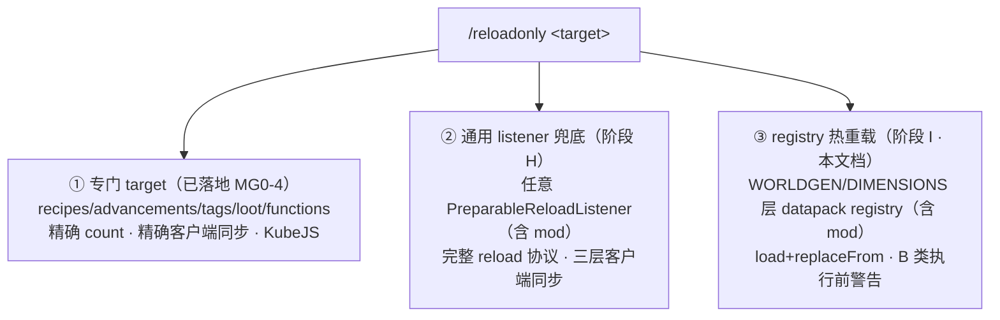
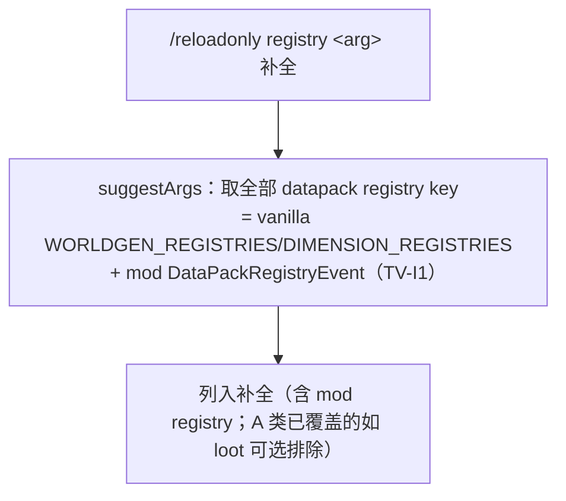

# datapack registry 热重载 · 设计文档（阶段 I）

> 归属：`feature/reload-only-data` 的**深度扩展**，突破 [reload-only-data-design.md](../reload-only-data-design.md) §2.2 定义的「B 类 datapack registries 不可热重载」边界。
> 本文档总结从「通用 listener 兜底」（[generic-fallback-plan.md](generic-fallback-plan.md)，阶段 H）延伸到「registry 层热重载」的完整探索，聚焦本次用户拍板的新方向。
> 方法遵循 `parallel-task-planning` 的 Stage 1（可行性 + 架构 + 风险 + 边界，基于 javap 核实事实）。

---

## 0. 能力全景（三层深度选择性重载）

原设计把内容分「A 类可热重载 / B 类不可」。深入底层后，能力扩展为**三层**：



- **① 专门 target**：A 类里已知的 5 种，最精确（[reload-only-data-design.md](../reload-only-data-design.md)）。
- **② listener 兜底**：A 类里未专门处理的（主要是 mod 的 `PreparableReloadListener`）（[generic-fallback-plan.md](generic-fallback-plan.md)）。
- **③ registry 热重载**：**原 B 类**——本文档新增，让 datapack registry 也能热重载。

---

## 1. 用户决策（本设计前提，2026-07-07）

1. **接管全部类型的热重载**——不做安全白名单区分，所有 datapack registry（含生成固化型如 biome/structure）都提供热重载能力；**但对 B 类 registry 在执行前向用户发送警告**（告知可能不一致的风险，由用户决定是否继续）。
2. **mod 的 `DataPackRegistryEvent` 注册的自定义 registry 自动纳入**可热重载列表（无需 mod opt-in）。

> 设计哲学：**提供能力 + 充分告知风险 + 用户自主决定**，而非替用户禁止。这是比 Mojang「一刀切冻结 WORLDGEN 层」更开放的选择。

---

## 2. 核实事实（`verified` via javap，两版对照）

| # | 事实 | Forge 1.20.1 | NeoForge 1.21.1 |
|---|---|---|---|
| R1 | `RegistryLayer` 分层 | `STATIC` / `WORLDGEN` / `DIMENSIONS` / `RELOADABLE`（4 层） | **同**（4 层一致） |
| R2 | `LayeredRegistryAccess.replaceFrom(layer, Frozen...)` 替换某层及之后 | ✅ 有 | ✅ 有 |
| R3 | `RegistryDataLoader.load(RM, RegistryAccess, List<RegistryData>) : RegistryAccess$Frozen` 重新载入 | ✅ 有（仅此 3 参重载） | ✅ 有（另有 Map 网络解码重载） |
| R4 | `RegistryDataLoader.WORLDGEN_REGISTRIES` / `DIMENSION_REGISTRIES` 常量 | ✅ 有 | ✅ 有 + `SYNCHRONIZED_REGISTRIES` |
| R5 | `DataPackRegistryEvent`（mod 注册自定义 registry） | `net.minecraftforge.registries.DataPackRegistryEvent` | `net.neoforged.neoforge.registries.DataPackRegistryEvent` |
| R6 | `DataPackRegistryEvent$DataPackRegistryData` 内含 `RegistryDataLoader$RegistryData` | ✅（走同一 `RegistryDataLoader` 路） | ✅ |
| R7 | loot 所在层 | RELOADABLE 层**空**（1.20.1 loot 是 listener `LootDataManager`） | RELOADABLE 层含 loot（registry 化） |

**核心结论**：接管机制**两版几乎一致**——`RegistryDataLoader.load` 重新载入 → `replaceFrom` 替换层 → `MinecraftServerAccessor` 换进 server（loot 1.21 已用同一套）。`replaceFrom` 支持**任意** layer，不限 RELOADABLE。

**待核实（`to-verify`）→ ✅ 已核实（PI-1 · Agent2 · 2026-07-07 · javap）**：
| # | 事项 | 结论 |
|---|---|---|
| TV-I1 | mod registry 完整列表 | ✅ **两版 `DataPackRegistriesHooks.getDataPackRegistries()`**（Forge `net.minecraftforge.registries` / NeoForge `net.neoforged.neoforge.registries`）→ `List<RegistryDataLoader$RegistryData<?>>`，**含 mod**（mod 经 `addRegistryCodec` 注入）；另有 `getDataPackRegistriesWithDimensions()`（含 dimension）、`getSyncedCustomRegistries():Set<ResourceKey>`。签名两版一致、仅包名 `//? if` |
| TV-I2 | 客户端 registry 同步 | ✅ **必须重连**——`ClientboundRegistryDataPacket` **只在 `configuration` 阶段**；play 阶段 `ClientPacketListener` **无任何 registry 处理方法**。服务端替换 registry 后已连接客户端**无法运行时接收**，唯一生效路径 = 重连（重走 configuration）。`SYNCHRONIZED_REGISTRIES` 在 play 阶段重发**无效** |
| TV-I3 | Holder 引用一致性 | ✅ `getAccessForLoading(layer)`=该层**之前**所有层的合成（`getCompositeAccessForLayers(0,index)`）作载入基准；`replaceFrom(layer,list)` 从 layer 起替换 `list.size()` 层、**其余层保留**（超出抛「Too many values」）。→ **新层内部 Holder 自洽**；但后续层（如 DIMENSIONS 依赖 WORLDGEN）若不连带重载则保留旧引用 → 重载 WORLDGEN 宜用 `getDataPackRegistriesWithDimensions()` 连 DIMENSIONS 一起；**外部已有世界对象的旧引用不更新**（生成固化残留根源，§3/§7） |
| TV-I4 | 1.20.1 RELOADABLE 空 | ✅ 无影响——1.20.1 有 RELOADABLE 层（枚举确认，内容空/loot 是 listener）；`replaceFrom(WORLDGEN,…)` **保留其后 DIMENSIONS/RELOADABLE 层**（TV-I3），接管 WORLDGEN/DIMENSIONS 两版一致可行 |
| TV-I5 | accessor getter | ✅ `MinecraftServerAccessor` 现仅 setter，需补 `@Accessor("registries") LayeredRegistryAccess<RegistryLayer> …$getRegistries()` |

---

## 3. 为什么 B 类需要警告：使用模式分类

「能替换 registry」**≠**「热重载安全生效」。取决于该 registry 的数据**怎么被用**：

| 使用模式 | 例子 | 替换 registry 后 | 安全性 |
|---|---|---|---|
| **运行时查询** | loot、damage_type、enchantment(1.21 NBT 存 id)、banner/trim_pattern、jukebox_song、wolf/painting_variant | 下次 `registry.get(key)` 即新值 | ✅ 安全 |
| **生成时固化** | biome、configured/placed_feature、structure、structure_set、noise_settings | 已生成区块**固化了旧数据**；新旧区块不一致 | ⚠️ 危险 |
| **世界创建时确定** | dimension、dimension_type（部分） | 结构性，运行时改需重建世界 | ⚠️ 危险 |

- **我们无法自动判断**一个 registry 属于哪类（无元数据标记，尤其 mod registry）。
- **PI-7 落地修正（CR-I2）**：原设想「所有 WORLDGEN registry 一律警告后允许」被实测推翻——**整层替换即便 reload 叶子型也损坏存档**（见 §4.1）。改为**按 registry key 硬编码黑名单**：生成固化型（`worldgen/*` + `dimension_type`）一律**拒绝**（从补全剔除 + reload 报错）；仅**叶子型**（运行时查询型，如 damage_type/enchantment）允许，执行前**警告 + confirm**。A 类（listener + RELOADABLE loot）不警告。
- 警告内容（叶子型）：客户端需**重连**才能看到变化（见 §5）；confirm 确认。

---

## 4. 架构设计

### 4.1 `RegistryReloadTarget`（单-registry 替换 + 黑名单）

实现现有 `ReloadTarget` 接口（与阶段 H 同框架），包装 `registry` 单 target（arg = registry key）。

> **⚠️ PI-7 决定性修正（CR-I2）**：初版用**整层替换**（`RegistryDataLoader.load(全部) → replaceFrom(WORLDGEN, fresh)`），实测**即便只 reload `damage_type` 也损坏存档**——整个 WORLDGEN 层被换成全新对象，DIMENSIONS 层 Holder 引用陈旧 → `stop` 时 `WorldGenSettings.encode` 报大量 `is not valid in current registry set` → level.dat 的 `dimensions`/`seed` 写空 → **下次启动 `No key dimensions` 无法加载世界**。改为**单-registry 替换**。

**单-registry 替换机制（两版通用）**：只重载目标一个 registry，其余 WORLDGEN registry **保留旧对象引用**，合成新 WORLDGEN 层：

```java
public int reload(MinecraftServer server, String arg) {
    ResourceLocation targetId = ResourceLocation.tryParse(arg);
    if (isBlacklisted(targetId))            // worldgen/* + dimension_type：拒绝
        throw new IllegalArgumentException("... blacklisted ...");
    LayeredRegistryAccess<RegistryLayer> layered = ((MinecraftServerAccessor) server).getRegistries();
    ResourceKey<? extends Registry<?>> targetKey = ResourceKey.createRegistryKey(targetId);
    RegistryData<?> targetData = /* 从 getDataPackRegistries() 按 key 找 */;
    RegistryAccess.Frozen oldWorldgen = layered.getLayer(RegistryLayer.WORLDGEN);
    // 1. 只 load 目标一个 registry（RM 用 openReloadResourceManager 重建、含运行时新增命名空间；RV7）
    RegistryAccess.Frozen freshOne;
    try (CloseableResourceManager rm = KubeJsCompat.openReloadResourceManager(server)) {
        freshOne = RegistryDataLoader.load(
            rm, layered.getAccessForLoading(RegistryLayer.WORLDGEN), List.of(targetData));
    }
    Registry<?> newReg = freshOne.registryOrThrow(targetKey);
    // 2. 合成：旧全部 registry（同引用）+ 目标替换为新
    Map<ResourceKey<? extends Registry<?>>, Registry<?>> merged = new HashMap<>();
    oldWorldgen.registries().forEach(e -> merged.put(e.key(), e.value()));
    merged.put(targetKey, newReg);
    RegistryAccess.Frozen newWorldgen = new RegistryAccess.ImmutableRegistryAccess(merged).freeze();
    // 3. 替换 WORLDGEN（显式带 DIMENSIONS/RELOADABLE 旧层，否则 replaceFrom 截断丢失）
    ((MinecraftServerAccessor) server).setRegistries(
        layered.replaceFrom(RegistryLayer.WORLDGEN, newWorldgen,
            layered.getLayer(RegistryLayer.DIMENSIONS), layered.getLayer(RegistryLayer.RELOADABLE)));
    return newReg.keySet().size();
}
```

- **为何不损坏存档**：DIMENSIONS 层引用的 biome/density_function 等仍是**旧 WORLDGEN 中的同一对象**（保留引用），`encode` 不失效。
- **黑名单**（`isBlacklisted`）：`worldgen/*` path 前缀 + `dimension_type`/`dimension`（生成固化型，被 DIMENSIONS/区块引用，单独替换仍破坏一致性）。`suggestArgs` 剔除、`reload` 拒绝。仅叶子型（不被 worldgen 引用的运行时查询型）可重载。
- **两版一致**：仅 `DataPackRegistriesHooks` 包名 `//? if`；`ImmutableRegistryAccess(Map)`/`registries()`/`freeze()`/`RegistryEntry.key()/value()` 两版 javap 核实一致。

### 4.2 自动纳入（含 mod `DataPackRegistryEvent`）

> **CR-I1（PI-2 落地修正）**：命令 `<target>` 用 `StringArgumentType.word()` **不接受冒号/斜杠 id**，故不为每个 registry 建独立 target。改为**单个 `registry` target**（`id="registry"`、`acceptsArg=true`、`requiresConfirmation=true`），registry key 走 `arg`（`greedyString`，同 tags 的 `minecraft:item`）；registry 列表由 `suggestArgs(server)` **运行时动态列出**——故**无需 SERVER_STARTED 枚举**，`registry` target 静态注册一行即可（比阶段 H 简单）。

`suggestArgs(server)` 动态列出**全部 datapack registry key**（供 arg 补全）：



- **mod registry 自动纳入**（用户决策 2）：mod 通过 `DataPackRegistryEvent` 注册的 registry 出现在完整列表里（TV-I1），无需 mod 适配。
- arg 用 registry 的 `ResourceKey.location()`（如 `minecraft:worldgen/biome`、`mymod:custom_data`）。

### 4.3 警告机制（B 类执行前告知）

`ReloadTarget` 扩展一个危险标记 + 命令层二次确认（**PI-2 已落地**）：

```java
default boolean requiresConfirmation() { return false; }  // registry target 返回 true
```

命令流程（`/reloadonly registry <registryKey> [confirm]`，见 CR-I1）：
1. 无 `confirm` 且 `requiresConfirmation()` → **只发警告、不执行**：
   > ⚠️ 重载 registry `<key>` 可能导致**已生成世界与新数据不一致**（生成类内容如生物群系/结构不会追溯改变），且客户端可能需**重新连接**才能看到变化。确认请执行 `/reloadonly registry <key> confirm`。
2. 带 `confirm` → 剥离后执行重载 + 客户端同步（§5）。

> 与阶段 H 的 `isGeneric()` 类似，是接口的又一 default 位，命令层据此分支，**不改门面核心**。

---

## 5. 客户端同步（registry 层，难点）

registry 的客户端同步比 listener 数据更棘手：客户端 registry 在**登录 configuration 阶段**建立并冻结。

- **✅ TV-I2 核实结论（决定性）**：`ClientboundRegistryDataPacket` **只存在于 `configuration` 阶段**（`net.minecraft.network.protocol.configuration`）；客户端 play 阶段的 `ClientPacketListener` **没有任何 registry 处理方法**（javap 确认）。→ 服务端 registry 替换后，**已连接客户端无法在 play 阶段运行时接收**，`SYNCHRONIZED_REGISTRIES` 重发在 play 阶段**无效**。
- **唯一客户端生效路径 = 重连**：重连时客户端重走 configuration 阶段、拿到新 registry。
- **对 PI-4/RegistrySync 的落地**（✅ 已实现）：**不发包**；`RegistrySync.toAllClients(server, key)` = **向所有在线玩家广播 `client_hint`「需重连」**（`sendSystemMessage`，两版通用、无 registry 包）；命令层 `client_hint` 补覆盖 console/非玩家发起者。（可选激进方案：主动断开在线玩家迫使重连——默认不做。）
- **两版一致**：1.20.1 亦然（registry 同步在更早的登录阶段），play 阶段无 registry 更新包。

---

## 6. 两版差异清单

| 差异点 | Forge 1.20.1 | NeoForge 1.21.1 |
|---|---|---|
| RegistryLayer / replaceFrom / load | 一致（R1-R3） | 一致 |
| loot 归属 | listener（`LootDataManager`），RELOADABLE 层空 | RELOADABLE 层 registry |
| `DataPackRegistryEvent` 包 | `net.minecraftforge.registries` | `net.neoforged.neoforge.registries` |
| mod registry 列表来源 | `DataPackRegistriesHooks.getDataPackRegistries()`（`net.minecraftforge.registries`） | 同（`net.neoforged.neoforge.registries`） |
| 客户端同步 registry 子集 | 无 `SYNCHRONIZED_REGISTRIES` | 有 `SYNCHRONIZED_REGISTRIES` |

隔离面小：核心三步两版通用；仅 `DataPackRegistryEvent` 包名 + mod 列表 hook + 客户端同步用 `//? if`。

---

## 7. 风险登记

| 风险 | 级别 | 缓解 |
|---|---|---|
| **生成固化型 registry 热重载致世界不一致**（biome/structure 已写入区块） | **H** | 执行前**强制警告 + confirm**（§4.3）；文案明确「已生成内容不追溯」；用户自主决定 |
| **客户端 registry 无法运行时同步** | H | 警告告知「可能需重连」；`SYNCHRONIZED_REGISTRIES` 尽力重发（TV-I2） |
| **Holder 引用一致性破坏**：整层替换后跨 registry Holder 失效 | H | `getAccessForLoading(layer)` 以下层为基载入；重载**整层**而非单个 registry，保内部引用自洽；核实 TV-I3 |
| **整层替换粒度粗**：想重载一个却动全层 | M | 文档说明 registry 层是「整层重载」；命令按 registry 暴露但底层重载全层（可接受，全层数据来自同一 ResourceManager） |
| **mod registry 列表取不全** | M | TV-I1 核实 Forge/NeoForge hook；取不到时至少覆盖 vanilla WORLDGEN/DIMENSION |
| **dimension 热重载**：结构性不可变 | M | 归入警告范围；或对 DIMENSIONS 层给更强警告/直接拒绝（待定） |
| **replaceFrom 后 server 其他引用未更新** | M | 复用 loot 已验证的 `MinecraftServerAccessor.setRegistries`；`reloadableRegistries()` 每次派生（同 loot） |

---

## 8. 边界与非目标

- **不追溯已生成世界**：热重载只影响之后的查询/生成；已固化的区块/维度不变（警告告知）。
- **不保证客户端即时一致**：可能需重连（§5）。
- **不做 STATIC 层**：代码注册的内置 registry 非 datapack，不在范围。
- **单机 vs 专用服务器**：单机客户端=服务端，registry 替换对客户端渲染的影响与专用服务器不同；以专用服务器语义为准。

---

## 9. 与阶段 H（listener 兜底）的关系

| 维度 | 阶段 H（listener） | 阶段 I（registry） |
|---|---|---|
| 对象 | `PreparableReloadListener`（A 类未专门处理的） | datapack registry（原 B 类，WORLDGEN/DIMENSIONS 层） |
| 重载入口 | `listener.reload(barrier,…)` | `RegistryDataLoader.load` + `replaceFrom` |
| 粒度 | 单个 listener | **整层**（该层全部 registry） |
| 客户端同步 | 三层（L1 包 / L2 事件 / L3 无） | `SYNCHRONIZED_REGISTRIES` 尽力 + **重连兜底** |
| 风险 | 低（依赖顺序提示） | **高（世界不一致，需警告 confirm）** |
| 共用 | 同 `ReloadTarget` 接口、`ReloadTargets` 注册表、`MinecraftServerAccessor`、SERVER_STARTED 动态注册 | 同左 |

两阶段共享同一框架，`RegistryReloadTarget` 只是 `ReloadTarget` 的又一实现 + 一个 `requiresConfirmation()` default 位。

---

## 10. 里程碑（粗粒度，待展开 WBS）

| ID | 里程碑 | 可验证状态 |
|---|---|---|
| **MI0** | registry 热重载跑通 | 两版 `/reloadonly minecraft:worldgen/biome confirm` 走 `load+replaceFrom+setRegistries` 成功、无崩溃；`server.registryAccess()` 反映新数据；无 confirm 时只发警告 |
| **MI1** | mod registry 自动纳入 | mod `DataPackRegistryEvent` 的 registry 出现在补全 + 可重载（用户测试 mod 坐实，TV-I1） |
| **MI2** | 客户端表现核实 | 明确哪些能运行时同步、哪些需重连（TV-I2），警告文案与实际一致 |

---

## 11. 待核实清单 → ✅ 全部核实（PI-1 · Agent2 · 2026-07-07）

结论详见 §2 已核实表；要点：
- **TV-I1** ✅ `DataPackRegistriesHooks.getDataPackRegistries()`（含 mod，两版仅包名异）。
- **TV-I2** ✅ 客户端 registry 仅 configuration 阶段同步、play 阶段无更新 → **必须重连**；PI-4 退化为提示重连。
- **TV-I3** ✅ `replaceFrom` 从 layer 替 `list.size()` 层其余保留 + `getAccessForLoading`=下层合成；新层内部自洽、外部旧引用不更新；重载 WORLDGEN 宜连 DIMENSIONS。
- **TV-I4** ✅ 1.20.1 RELOADABLE 空无影响，`replaceFrom` 保留后续层，两版可行。
- **TV-I5** ✅ 需补 `@Accessor` getter。

> ✅ PI-1 核实完成，解锁 Gate I0 → 阶段 I1（PI-2 契约冻结）可开始。
