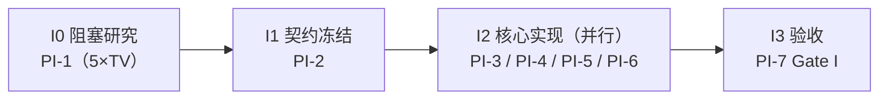
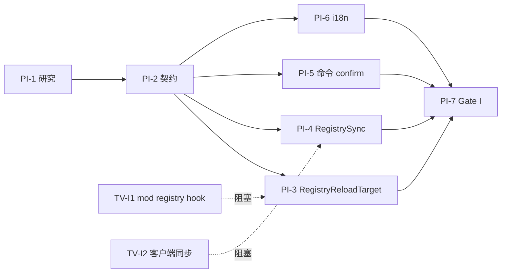

# datapack registry 热重载 · 平行任务表（阶段 I）

> 源自 [registry-reload-design.md](registry-reload-design.md)（Stage 1 设计）。遵循 `parallel-task-planning`：Stage 2（里程碑/WBS）+ Stage 3（平行重组）合一。
> 与 rod 主项目 [parallel-tasks.md](parallel-tasks.md)、阶段 H [generic-fallback-plan.md](generic-fallback-plan.md) **同框架、同分工惯例**（Agent1 核心 / Agent2 命令·i18n）、同「☐→◐→☑ + 行级回写」进度协议。

---

## 0. 前置说明与关键决策

**与阶段 H 的关系**：阶段 I 复用 `ReloadTarget` 框架、`MinecraftServerAccessor`、命令/lang 接力文件。二者共享接力文件（`ReloadTarget`/`ReloadTargets`/`ModCommands`/`lang`/`MinecraftServerAccessor`）→ **跨阶段串行接力**（H 先 I 后，或 I 独立加自己那部分，串行安全）；若并行需按文件所有权矩阵（§4）错开。

**CR-I1（命令形式定案，对设计 §4.2/§4.3 的实现调整）**：
- 设计文档设想「每个 registry 注册一个 `RegistryReloadTarget`（id=registry key）」。但**核实 `ModCommands`**：`/reloadonly <target>` 的 `<target>` 用 `StringArgumentType.word()`，**不接受冒号/斜杠**；而 registry key（`minecraft:worldgen/biome`）含冒号斜杠。
- **改为**：单个 `registry` target（`id="registry"`，`word()` 可接受）+ `arg`（`greedyString()`，接受冒号斜杠，同 tags 的 `minecraft:item`）= `<registryKey> [confirm]`。
- **收益**：① 复用现有命令结构零改参数类型；② registry 列表经 `suggestArgs(server)` **运行时动态列出**（含 mod），故**无需 SERVER_STARTED 枚举注册**——比阶段 H 更简单，registry target 可**静态注册**（`ReloadTargets` 静态块一行）。
- 此调整须回填设计 §4.2/§4.3（PI-2 完成时）。

---

## 1. 冻结契约（阶段 I1 冻结，I2+ 只读）

**`ReloadTarget` 接口扩展（向后兼容 default）**：
```java
/** 执行前是否需用户二次确认（B 类 registry 返回 true；命令层据此先发警告）。 */
default boolean requiresConfirmation() { return false; }
```

**`MinecraftServerAccessor` 补 getter**（现仅 setter，TV-I5 确认需补）：
```java
@Accessor("registries")
LayeredRegistryAccess<RegistryLayer> reloadonlydata$getRegistries();   // 读当前，供 replaceFrom
```

**`registry` target 契约**（单 target + arg）：
- `id()="registry"`；`acceptsArg()=true`；`requiresConfirmation()=true`；`needsClientSync()=true`（sync 走 RegistrySync）。
- `arg` 语义：`<registryKey> [confirm]`（空格分隔，greedyString）。命令层剥离 `confirm` 后把纯 `registryKey` 传 `reload(server, registryKey)`。
- `suggestArgs(server)`：列全部 datapack registry key（vanilla `WORLDGEN_REGISTRIES`+`DIMENSION_REGISTRIES` + mod，来源见 TV-I1）。

**命令 confirm 流程**（`ModCommands.runReload`，仅加一处分支）：
```
若 target.requiresConfirmation() 且 arg 不含 "confirm" 标记 → 发 reload.registry.warn，return（不执行）；
否则 → 剥离 confirm，正常 ReloadService.reload(server, target, registryKey)。
```

**i18n key（PI-2 规划、PI-6 落地）**：
- `...reload.registry.warn`（`%s`=registryKey；警告 + 提示加 `confirm`）。
- `...reload.registry.success`（`%1$s`=条数、`%2$s`=ms）。
- `...reload.registry.client_hint`（客户端可能需重连才能看到变化）。

**registry key ↔ layer 映射**：由 registryKey 判定归属 `RegistryLayer.WORLDGEN` 还是 `DIMENSIONS`（据其是否在 `WORLDGEN_REGISTRIES` / `DIMENSION_REGISTRIES` 列表）——PI-3 落地。

---

## 2. 流水线与里程碑



| 里程碑 | 内容 | 达成任务 |
|---|---|---|
| **MI0** | registry 热重载跑通（load+replaceFrom+setRegistries；无 confirm 只警告） | PI-3 + PI-5 |
| **MI1** | mod `DataPackRegistryEvent` registry 经 `suggestArgs` 出现且可重载 | PI-3（TV-I1）+ 用户 mod |
| **MI2** | 客户端表现核实（哪些运行时同步/哪些需重连），警告文案与实际一致 | PI-4（TV-I2）+ PI-7 |

---

## 3. 平行任务

### 阶段 I0 · 阻塞研究（前置：无）

**PI-1 · 核实 5 项 to-verify**  ☑ 负责:Agent2 产出:Agent2
- Owns：[registry-reload-design.md](registry-reload-design.md)（§11 TV 结论回填）
- Reads：设计文档全文
- 交付/验收：`TV-I1`（mod registry 列表 hook：Forge `DataPackRegistriesHooks` / NeoForge 等价，javap 确认 API）、`TV-I2`（客户端 registry 运行时同步能力：`SYNCHRONIZED_REGISTRIES` 重发是否生效 / 必须重连）、`TV-I3`（`getAccessForLoading(layer)` 重载整层 Holder 一致性）、`TV-I4`（1.20.1 RELOADABLE 空的影响）、`TV-I5`（accessor getter 已确认需补，✅ 本表已核实）——逐项 javap/一手源码结论写回设计。
- 映射：`TI0.1`。Cx：M。
- ✅ 已核实（本表提前完成）：**TV-I5** = `MinecraftServerAccessor` 现仅 setter，需补 `@Accessor("registries")` getter（§1）。
- ✅ **产出（PI-1 · Agent2 · javap 核实，结论已回填设计 §2/§5/§6/§11）**：
  - **TV-I1** `DataPackRegistriesHooks.getDataPackRegistries():List<RegistryDataLoader$RegistryData<?>>`（**含 mod**，两版仅包名 `//? if`）；另 `getDataPackRegistriesWithDimensions()`、`getSyncedCustomRegistries()`。→ PI-3 registry 列表来源定案。
  - **TV-I2**（决定性）`ClientboundRegistryDataPacket` **仅 configuration 阶段**、play 阶段客户端无 registry 处理 → **必须重连**，运行时发包无效 → **PI-4 简化为「提示重连」**（不发包）。
  - **TV-I3** `replaceFrom(layer,list)` 从 layer 替 `list.size()` 层、其余保留；`getAccessForLoading`=下层合成。新层内部 Holder 自洽、外部旧引用不更新；重载 WORLDGEN 宜连 DIMENSIONS（`getDataPackRegistriesWithDimensions`）。
  - **TV-I4** 1.20.1 有 RELOADABLE（空），`replaceFrom` 保留后续层，两版接管 WORLDGEN/DIMENSIONS 可行。
  - **对下游影响**：PI-4 从「尽力重发包」降级为「`client_hint` 提示重连」（TV-I2）；PI-2 契约 accessor getter 确认必需（TV-I5）。
- ✅ **Gate I0 通过** → 解锁阶段 I1（PI-2 契约冻结）。

### 阶段 I1 · 契约冻结（前置：I0）

**PI-2 · 契约扩展 + 命令形式定案**  ☑ 负责:Agent3 产出:Agent3
- Owns：`reload/ReloadTarget.java`（加 `requiresConfirmation()`）、`mixin/MinecraftServerAccessor.java`（补 getter）
- Reads：设计 §4、PI-1 研究结论
- 交付/验收：`requiresConfirmation()` default 位 + accessor getter；两版编译；CR-I1 命令形式 + i18n key 定稿供 PI-5/PI-6；**回填设计 §4.2/§4.3**（单 target+arg）。**冻结后解锁 I2。**
- 映射：`TI1.1`。Cx：S。
- ✅ **产出（Agent3）**：① `ReloadTarget.requiresConfirmation()` default false（Javadoc 注明 B 类 registry 返回 true → 命令层无 confirm 先警告）；② `MinecraftServerAccessor` 补 `@Accessor("registries") reloadonlydata$getRegistries()`（配现有 setter；Javadoc 更新为读写双用途），两版字段同名同型故通用；③ 两版 `compileJava` **BUILD SUCCESSFUL**（4 executed，Forge `--rerun-tasks` 触发 stonecutterGenerate）；④ 回填设计 §4.2/§4.3（CR-I1：单 `registry` target + arg=registryKey，`suggestArgs` 动态列，免 SERVER_STARTED 枚举）；⑤ i18n key 定稿（`registry.warn`/`success`/`client_hint`，§1）供 PI-6。**契约冻结，解锁 I2（PI-3/4/5/6 可并行认领）。**

### 阶段 I2 · 核心实现（前置：I1；四任务并行·文件不重叠）

**PI-3 · `RegistryReloadTarget` + 注册**  ☑ 负责:Agent1 产出:Agent1
- Owns：`reload/target/RegistryReloadTarget.java`、`reload/ReloadTargets.java`※（静态注册一行接力）
- Reads：契约（§1）、PI-1（`TV-I1` registry 列表、`TV-I3` Holder、`TV-I4`）、[LootReload.java](../../src/main/java/com/tonywww/reloadonlydata/reload/LootReload.java)（三步范式）
- 交付/验收：`reload(server, registryKey)` = 判 layer → `RegistryDataLoader.load(RM, layered.getAccessForLoading(layer), 全部datapackRegistryData)` → `layered.replaceFrom(layer, fresh)` → `setRegistries`；`suggestArgs` 列全部 datapack registry key（含 mod）；`requiresConfirmation=true`；两版编译（仅 mod 列表来源可能 `//? if`）。
- 映射：`TI2.1`+`TI2.2`。Cx：L。
- ✅ **产出（Agent1）**：`reload/target/RegistryReloadTarget.java`（新建）+ `ReloadTargets.java` 静态块注册一行；两版 `compileJava` **BUILD SUCCESSFUL**（仅 `DataPackRegistriesHooks` 包名 `//? if` forge=`net.minecraftforge.registries` / neoforge=`net.neoforged.neoforge.registries`，其余 API 两版通用）。三步机制：`RegistryDataLoader.load(RM, layered.getAccessForLoading(WORLDGEN), DataPackRegistriesHooks.getDataPackRegistries())` → `replaceFrom` → `setRegistries`；`suggestArgs` 迭代 `getDataPackRegistries()` 列全部 datapack registry key（含 mod）；`requiresConfirmation=true`；`needsClientSync=false`+`sync` 空+`postHint=client_hint`（TV-I2：客户端 registry 运行时不可同步、靠重连）。
  - **CR-I1 落地**：单 `registry` target（`id="registry"`、`word()` 接受）+ `arg=registryKey`；confirm 由命令层（PI-5）剥离后传纯 registryKey。
  - **🐞 replaceFrom 截断 bug（runServer 冒烟发现→已修）**：初版 `layered.replaceFrom(WORLDGEN, fresh)`（单 Frozen）把 WORLDGEN【及其后所有层】DIMENSIONS/RELOADABLE 一并截断丢失 → `stop` 时 `saveAllChunks→WorldGenSettings.encode→registryOrThrow(dimension)` 抛 `IllegalStateException: Missing registry: minecraft:dimension` + 批量 `Failed to save chunk`（**BUILD FAILED**）。**修复**：显式带旧层 `replaceFrom(WORLDGEN, fresh, getLayer(DIMENSIONS), getLayer(RELOADABLE))`（dimension 运行时不可变，保留旧层即可）。重编两版绿。**教训「编译过≠写对」——冒烟才暴露 runtime 截断。**
  - **Forge runServer 冒烟（MI0）**：`reloadonly registry minecraft:damage_type confirm` → `registry 重载完成：44 条、120 ms、2 来源包`（`reload.registry.success`），reload 无崩溃；`postHint` 触发（`Reconnect to apply...`）；无 confirm 只警告（`reload.registry.warn`，PI-5 confirm 分支坐实）。**修复后 `stop` 干净**：`ThreadedAnvilChunkStorage: All dimensions are saved` + **BUILD SUCCESSFUL**、**无** `Missing registry: dimension`。
  - **⚠️ 已知局限（如实记录，印证 TV-I3 + 设计 §3/§5）**：整层替换 WORLDGEN → 保存 level.dat 时 `WorldGenSettings.encode` 报大量 `Element Reference{...biome/dimension_type/noise_settings...} is not valid in current registry set`（DIMENSIONS 层旧 Holder 仍引用旧 WORLDGEN 对象、与新 composite 不符）。**非崩溃**（WARN、仍 All dimensions saved / BUILD SUCCESSFUL），是「`RegistryDataLoader.load` 只能整层重载、外部旧引用不更新」（TV-I3）的固有代价——叶子型 registry（damage_type / KubeJS 自定义）reload 干净，被 worldgen 引用的（biome 等）reload 后 dimension 引用陈旧。留 **PI-7** 复核 biome reload 的客户端表现与该 WARN。
  - **NeoForge 侧**：代码两版通用（仅包名 `//? if`）、编译绿；runServer 冒烟留 Gate I（PI-7）。

**PI-4 · `RegistrySync`（客户端同步）**  ☑ 负责:Agent1 产出:Agent1
- Owns：`reload/sync/RegistrySync.java`
- Reads：契约、PI-1（`TV-I2`）、[TagSync.java](../../src/main/java/com/tonywww/reloadonlydata/reload/sync/TagSync.java)（发包范式）
- 交付/验收：对 `SYNCHRONIZED_REGISTRIES` 子集尽力重发（`//? if`：1.21.1 有此常量 / 1.20.1 早期机制或降级）；无法运行时同步的→由命令 `client_hint` 提示重连；两版编译、runServer 触发无异常。
- 映射：`TI2.3`。Cx：M。
- ✅ **产出（Agent1）**：`reload/sync/RegistrySync.java`——**两版通用（无 `//? if`）**，两版 `compileJava` **BUILD SUCCESSFUL**。
  - **基于 TV-I2 的实现调整**：原设想「对 `SYNCHRONIZED_REGISTRIES` 尽力重发」；PI-1 核实 TV-I2 证实 **play 阶段发 registry 包无效**（客户端 registry 仅 configuration 阶段建立）→ **不发包**：`toAllClients(server, registryKey)` 退化为向所有在线玩家广播 `client_hint`「registry 已重载、需重连」（`sendSystemMessage`，两版通用）。**该调整已回填设计 §5**。
  - **与 PI-5 协调**：本类广播给所有在线玩家（含玩家发起者）；命令层 `client_hint` 主覆盖 console/非玩家发起者，避免玩家发起者重复。
  - **验证**：两版编译绿；端到端 runServer 触发需 PI-3（`RegistryReloadTarget.sync` 调 `RegistrySync.toAllClients`）联调，留 Gate I（PI-7）。

**PI-5 · 命令 confirm 分支**  ☑ 负责:Agent3 产出:Agent3
- Owns：`command/ModCommands.java`※（接力，仅加 confirm 分支一处）
- Reads：契约（`requiresConfirmation` + confirm 流程）
- 交付/验收：`runReload` 前置检查——`requiresConfirmation()` 且 arg 无 `confirm` → 发 `reload.registry.warn` return；有 `confirm` → 剥离后执行 + 成功后 `client_hint`；专门 5 类 + 通用 target 反馈不受影响（零回归）。
- 映射：`TI2.4`。Cx：S。
- ✅ **产出（Agent3）**：`runReload` 在 `target==null` 检查后加 confirm 分支——`requiresConfirmation()` 时解析 `arg`（`trimmed.endsWith(" confirm")`）：无 confirm → `sendFailure(reload.registry.warn, registryKey)` return；有 confirm → 剥离得纯 `effectiveArg`，后续 `ReloadService.reload` 与 `postHint` 均用 `effectiveArg`（`client_hint` 由 registry target 的 `postHint` 下发，PI-3）。两版 `compileJava` **BUILD SUCCESSFUL**。**零回归**：专门 5 类 + 通用 target `requiresConfirmation()` 默认 false → 跳过分支、`effectiveArg=arg` 原样，行为不变。

**PI-6 · i18n**  ☑ 负责:Agent2 产出:Agent2
- Owns：`assets/reloadonlydata/lang/*.json`※（接力）
- Reads：契约（key 规划）
- 交付/验收：`registry.warn`/`registry.success`/`registry.client_hint` 中英齐全、JSON 校验。
- 映射：`TI2.5`。Cx：S。
- ✅ **产出（Agent2）**：两版 `lang/{en_us,zh_cn}.json` 各加 3 key（第 14–16 key），IDE JSON 校验无误：
  - `reload.registry.warn`（`%s`=registryKey）：警告已生成世界可能不一致（生物群系/结构不追溯）+ 客户端可能需重连 + 末尾加 `confirm` 确认。供 PI-5 命令层 `sendFailure`。
  - `reload.registry.success`（`%1$s`=条目数、`%2$s`=ms）：「Reloaded registry: N entries in T ms」/「已重载注册表：N 个条目，耗时 T 毫秒」。命令层 `reload.<target>.success`（target=registry）。
  - `reload.registry.client_hint`（`%s`=registryKey）：服务端已重载、需重连才在客户端生效。供 PI-4 `RegistrySync.toAllClients` 广播。
  - 文案风格对齐现有（success 同 tags/loot 句式；warn/hint 同 ingredient_hint 提示风格）。**PI-5 已引用的 `registry.warn` key 现已落地**，运行时不再显示 raw key。

### 阶段 I3 · 验收（前置：I2）

**PI-7 · Gate I 验证**  ☑ 负责:Agent1 产出:Agent1
- Owns：`docs/rod/test-report.md`※（追加 §5.9 registry 热重载节）、`reload/target/RegistryReloadTarget.java`（重构）、`lang/*.json`※（warn 文案）
- Reads：全部
- 交付/验收：两版 runServer——① 无 confirm → 只发警告不执行；② 加 `confirm` → 成功、无崩溃、`client_hint` 显示；③ mod registry 经 `suggestArgs` 出现且可重载（MI1）；④ 两版 `:build` 绿；⑤ **专门 5 类零回归**。客户端表现按 TV-I2 如实记录。
- 映射：`TI3.1`。Cx：M。
- ✅ **产出（Agent1）**：**PI-7 实测发现并修复 PI-3 整层替换的存档损坏 bug（见 CR-I2）**，重构 `RegistryReloadTarget` 为单-registry 替换 + 黑名单，两版 runServer + `:build` 全绿。
  - **存档损坏 bug（决定性发现）**：PI-3 整层替换（`replaceFrom(WORLDGEN, fresh)` 以 `getDataPackRegistries()` 全量 load）——即便只 reload `damage_type`，整个 WORLDGEN 层被换新对象 → DIMENSIONS 层 Holder 引用陈旧 → stop 时 `WorldGenSettings.encode` 大量 `is not valid in current registry set` → level.dat 的 `dimensions`/`seed` 写空 → **下次启动 `No key dimensions in MapLike[{}]` 无法加载世界（存档损坏）**。PI-3 当时「stop 干净」是假象（那批 WARN 就是 encode 失败前兆）。
  - **修复 = 单-registry 替换（用户定方案 B）**：只重载目标一个 registry（`RegistryDataLoader.load(RM, getAccessForLoading(WORLDGEN), List.of(targetData))`），其余 WORLDGEN registry 保留旧对象引用（`oldWorldgen.registries().forEach(→merged.put)` + `merged.put(targetKey, newReg)` → `new ImmutableRegistryAccess(merged).freeze()`）→ DIMENSIONS 引用仍有效、level.dat 不损坏。API 两版 javap 核实（`ImmutableRegistryAccess(Map)`/`registries()`/`freeze()`/`RegistryEntry.key()/value()`）。
  - **黑名单（生成固化型）**：`isBlacklisted` = `worldgen/*` path 前缀 + 显式 Set（biome/noise/noise_settings/density_function/configured_carver/configured_feature/placed_feature/structure/structure_set/template_pool/processor_list/multi_noise…/flat_level_generator_preset/world_preset/dimension_type/dimension）。`suggestArgs` 剔除黑名单、`reload` 拒绝并招 `blacklisted` 异常。仅叶子型（damage_type/enchantment/trim 等）可重载。
  - **Forge 1.20.1 双会话铁证**：会话1 `damage_type`=44条/8ms成功 + `worldgen/biome` 黑名单拒绝 + `recipes`=1174 零回归 + stop 干净（**无** `not valid` WARN）；**会话2 重启世界正常加载 `Done (3.480s)!`**（无 `No key dimensions`）= 存档未损坏。
  - **NeoForge 1.21.1**：`damage_type`=48条/2ms成功 + `worldgen/biome` 拒绝 + `recipes`=1289 零回归 + stop 干净无 WARN。（NeoForge 首次 runServer 撞 stonecutter 陈旧生成缓存 `refreshServerDataPack` 报错，与本改动无关——`--rerun-tasks` 强制重生成即过。）
  - **两版 `:build`** BUILD SUCCESSFUL（17 tasks remapJar/assemble）。
  - **lang warn 文案同步**：重构后固化型走黑名单 `failed` 而非 `warn`，故 `registry.warn` 改为「叶子型立即生效 + 客户端需重连 + worldgen 黑名单无法重载 + confirm」（两版 en/zh）。
  - **MI1**：mod 自定义叶子型 registry 走 `getDataPackRegistries()` 同一路径（机制已通）；本环境 mod（betteradvancedtooltips 等）未注册自定义 datapack registry，留用户带自定义 registry 的 mod 坐实。

---

## 4. 文件所有权矩阵（防冲突）

| 文件 | 拥有任务 | 阶段 | 与阶段 H 接力? |
|---|---|---|---|
| `registry-reload-design.md` | PI-1 | I0 | — |
| `reload/ReloadTarget.java` | PI-2 | I1 | ※ H 的 PH-1 也扩展（加 `isGeneric`）→ 跨阶段串行 |
| `mixin/MinecraftServerAccessor.java` | PI-2 | I1 | 本阶段独有（补 getter） |
| `reload/target/RegistryReloadTarget.java` | PI-3 | I2 | 新文件，独有 |
| `reload/ReloadTargets.java`※ | PI-3 | I2 | ※ H 的 PH-2 也注册 → 跨阶段串行 |
| `reload/sync/RegistrySync.java` | PI-4 | I2 | 新文件，独有 |
| `command/ModCommands.java`※ | PI-5 | I2 | ※ H 的 PH-3 也改 → 跨阶段串行 |
| `assets/.../lang/*.json`※ | PI-6 | I2 | ※ H 的 PH-4 也加 → 跨阶段串行 |
| `docs/rod/test-report.md`※ | PI-7 | I3 | ※ 各阶段追加不同节 |

> **同阶段 I2 内 PI-3/4/5/6 文件零重叠**（`RegistryReloadTarget`+`ReloadTargets` / `RegistrySync` / `ModCommands` / `lang`）。※=跨阶段接力（串行安全，逐行追加不覆盖）。**若阶段 H 与 I 同期推进**：`ReloadTarget`/`ReloadTargets`/`ModCommands`/`lang` 四个接力文件须 H、I 串行改（先 H 后 I），不可同时。

---

## 5. 依赖图 / 关键路径



**关键路径**：PI-1 → PI-2 → PI-3 → PI-7。

---

## 6. 进度更新协议 + 每阶段 Gate

**认领/回写**（同 rod 惯例）：认领 ☐→◐ 签名；只改 `Owns` 文件、`Reads` 只读；完成后**行级回写**——本表任务 ◐→☑ + 产出；勾对应 `TI` 映射；若解决/推翻 TV 项则更新设计文档对应节（re-read 冲突则重试，勿整体覆盖）。

**Gate（每阶段边界）**：
- **Gate I0**：5 项 TV 全部 javap/源码核实、结论回填设计 §11 → 解锁 I1。
- **Gate I1**：`requiresConfirmation()`+accessor getter 两版编译；命令形式/key 定稿；设计 §4 回填 → 冻结解锁 I2。
- **Gate I2**：PI-3/4/5/6 全 ☑，两版 `compileJava` 绿 → 解锁 I3。
- **Gate I（MI0-2）**：PI-7 验收矩阵通过（§3）→ 阶段 I 完成。

---

## 7. 风险登记（源自设计 §7，落到任务）

| 风险 | 级别 | 缓解 | 归属任务 |
|---|---|---|---|
| 生成固化型 registry 致世界不一致 | H | 强制 `warn`+`confirm`（§1） | PI-5 |
| 客户端 registry 无法运行时同步 | H | `client_hint` 提示重连；`SYNCHRONIZED_REGISTRIES` 尽力 | PI-4/PI-5 |
| Holder 引用一致性破坏 | H | 整层重载 + `getAccessForLoading` 以下层为基（TV-I3） | PI-1/PI-3 |
| mod registry 列表取不全 | M | TV-I1 核实 hook；取不到至少覆盖 vanilla | PI-1/PI-3 |
| 与阶段 H 接力文件冲突 | M | §4 矩阵 + H/I 串行改接力文件 | 全体 |
| `replaceFrom` 后 server 其他引用未更新 | M | 复用 loot 已验证 `setRegistries` + `reloadableRegistries()` 派生 | PI-3 |
| **运行时新增 datapack registry 内容读不到**（`RegistryDataLoader.load` 复用 `server.getResourceManager()`，其命名空间索引构造时固化——见 [parallel-tasks.md](parallel-tasks.md) **§5 RV7**） | **H** | **✅ PI-7 已落地**：`RegistryDataLoader.load` 的 RM 传 `KubeJsCompat.openReloadResourceManager(server)`（重建 RM + 全新命名空间索引），`try-with-resources` 关闭；勿直接用 `server.getResourceManager()`。**实测坐实**：运行时新建 `rvtest` 新命名空间 damage_type → reload 44→45（修复前索引固化读不到） | ~~PI-3~~ PI-7 |

---

## 8. WBS ↔ 里程碑 ↔ TV 映射

| WBS | 任务 | 里程碑 | 依赖 TV |
|---|---|---|---|
| TI0.1 | 5×TV 核实（PI-1） | 前置 | — |
| TI1.1 | 契约 + 命令定案（PI-2） | 前置 | TV-I5 |
| TI2.1/2.2 | RegistryReloadTarget + 注册（PI-3） | MI0/MI1 | TV-I1/I3/I4 |
| TI2.3 | RegistrySync（PI-4） | MI2 | TV-I2 |
| TI2.4 | 命令 confirm（PI-5） | MI0 | — |
| TI2.5 | i18n（PI-6） | MI0 | — |
| TI3.1 | Gate I 验证（PI-7） | MI0-2 | 全部 |

---

## 9. 变更登记（CR）

| # | 日期 | 提出 | 内容 | 处置 |
|---|---|---|---|---|
| CR-I1 | 2026-07-07 | 平行任务规划 | 命令形式：设计 §4.2「每 registry 一个 target」→「单 `registry` target + arg=registryKey [confirm]」（因 `<target>` 用 `word()` 不接受冒号斜杠 id；复用现有 arg=greedyString）。连带：无需 SERVER_STARTED 枚举，registry target 静态注册 + `suggestArgs` 动态列 | 已 PI-2 落地并回填设计 §4.2/§4.3 |
| CR-I2 | 2026-07-07 | PI-7 实测 | **整层替换 → 单-registry 替换 + 生成固化型黑名单**（用户定方案 B）。因 PI-3 整层 `replaceFrom(WORLDGEN, fresh)` 即便 reload 叶子型也会使 DIMENSIONS 引用陈旧→level.dat 写空 `dimensions`/`seed`→重启 `No key dimensions` **存档损坏**（PI-7 实测）。改为只重载目标 registry、保留其余 WORLDGEN 对象引用（`ImmutableRegistryAccess` 合成）；`worldgen/*`+`dimension_type` 黑名单拒绝（suggestArgs 剔除+reload 报 blacklisted），仅叶子型（damage_type/enchantment 等）可重载。连带：lang warn 文案重写 | 已 PI-7 落地（RegistryReloadTarget 重构 + 两版验证 + §5.9） |

---

## 10. Definition of Done（阶段 I）

- ☑ 5×TV 核实回填设计（Gate I0，PI-1 Agent2 ✅）。
- ☑ `requiresConfirmation()` + accessor getter 两版编译（Gate I1，PI-2 ☑ Agent3）。
- ☑ 两版 `/reloadonly registry <叶子型 key>` 无 confirm 只警告、带 confirm 单-registry 替换成功无崩溃（MI0，PI-7 ✅ Forge damage_type=44/8ms + NeoForge 48/2ms；黑名单固化型拒绝；Forge 会话2 重启存档未损坏）。
- ◐ mod `DataPackRegistryEvent` registry 经 `suggestArgs` 出现且可重载（MI1，机制已通：`suggestArgs` 迭代 `getDataPackRegistries()` 含 mod、非黑名单可重载；待用户带自定义叶子型 registry 的 mod 坐实）。
- ☑ 客户端表现按 TV-I2 如实记录（MI2）：运行时不可同步、`client_hint` 提示重连；固化型已黑名单拒绝→无「已生成世界残留」问题。
- ☑ 两版 `:build` 绿（BUILD SUCCESSFUL 17 tasks）；专门 5 类（recipes 1174/1289）**零回归**。
- ☑ i18n 中英齐全（PI-6 ✅，PI-7 同步 warn 文案）；设计 §4.2/§4.3 回填 CR-I1（PI-2 ✅）；test-report 追加 §5.9 registry 节（PI-7 ✅）；CR-I2 黑名单+单-registry 替换（PI-7 ✅）。
