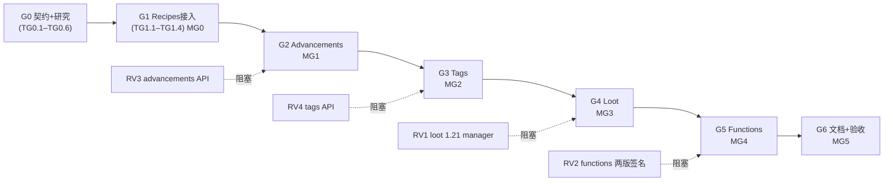

# ReloadOnly-Data 扩展 · 总任务表（Master Task Plan）

> 依据：[reload-only-data-design.md](../reload-only-data-design.md)（泛化总设计）+ 已落地基线 [reload-only-recipes-design.md](../reload-only-recipes-design.md) / [task-plan.md](../task-plan.md) / [parallel-tasks.md](../parallel-tasks.md)。
> 范围：在**已双版本 M2 通过的 recipes 基线**之上，泛化为「按类型选择性重载多种数据包内容」——recipes（接入框架）→ advancements → tags(per-registry) → loot → functions；双版本 **Forge 1.20.1（Java 17）+ NeoForge 1.21.1（Java 21）**；纯 Java；Stonecutter + Architectury Loom flat；**避免反射，用带判断的 Mixin `@Invoker/@Accessor` + `modCompileOnly` 软兼容 + 类隔离**。
> 分支：`feature/reload-only-data`。
> 状态：☐ 待办 · ◐ 进行中 · ☑ 完成 · ⛔ 阻塞。复杂度：S 小 / M 中 / L 大。**不做时间估算**（以复杂度 + 依赖表达）。

---

## 里程碑

| 里程碑 | 目标（可交付 & 可验证） | 覆盖阶段 |
|---|---|---|
| **MG0 泛化骨架 + recipes 接入** | `ReloadTarget`/`ReloadService`/`ReloadTargets`/`ContentScanner` 契约就绪；`/reloadonly recipes` **等价** 现有 `/reloadrecipes`（重构零回归，两版 runServer 通过） | 阶段 G0–G1 |
| **MG1 Advancements** | `/reloadonly advancements` 改成就即时生效 + **在线玩家进度正确重算**（两版） | 阶段 G2 |
| **MG2 Tags（per-registry）** | `/reloadonly tags <registry>` 重载单个 registry 标签并同步客户端 + **ingredient 提示**（两版） | 阶段 G3 |
| **MG3 Loot** | `/reloadonly loot` 重载 loot_tables/predicates/item_modifiers（双版本各自 manager）（两版） | 阶段 G4 |
| **MG4 Functions** | `/reloadonly functions` 重载 mcfunction + function-tag 依赖提示（两版） | 阶段 G5 |
| **MG5 可发布** | 文档对齐、命令帮助/限制齐全、验收矩阵通过 | 阶段 G6 |

---

## 阶段 G0 · 泛化契约 + 研究 → 契约冻结

> 先冻结「泛化重载框架」的全部跨任务契约，并把后续各内容类型的 API 不确定项一次性研究清楚。契约任务改动 `ReloadResult` 会波及现有 recipes 链路，故在同一原子任务内完成适配，保证 Gate 编译绿、行为零变化。

| ID | 任务 | Cx | 依赖 | 验收标准 | 涉及文件 |
|---|---|---|---|---|---|
| ☑ TG0.1 | `ReloadTarget` 接口（`id`/`reload`/`sync`/`needsClientSync`/`affectedByKubeJS`/`acceptsArg`/`suggestArgs`） | M | — | 接口编译；签名冻结（写入平行表 §2） | `reload/ReloadTarget.java` |
| ☑ TG0.2 | `ReloadService` 泛化门面（`reload(server,target,arg)`：调 `target.reload`→按 `needsClientSync` 调 `target.sync`→统计/回落→`ReloadResult`） | M | TG0.1 | 门面编译；对任意 target 走统一流程 | `reload/ReloadService.java` |
| ☑ TG0.3 | `ReloadTargets` 注册表骨架（`register`/`get(id)`/`ids()`，`LinkedHashMap`，暂空） | S | TG0.1 | 注册表 API 就绪，供命令动态取 target | `reload/ReloadTargets.java` |
| ☑ TG0.4 | `ContentScanner` 泛化扫描（`scan(rm, FileToIdConverter)`，坏文件跳过；提取自 `RecipeScanner`） | S | — | 任意目录 SimpleJson 可扫描 | `reload/ContentScanner.java` |
| ☑ TG0.5 | `ReloadResult` 泛化（加 `target` 维度）+ **适配现有引用**（`RecipeReloadService` 构造处、`ModCommands` 读取处） | M | — | 两版 `compileJava` 绿；recipes 行为不变 | `util/ReloadResult.java`、`reload/RecipeReloadService.java`(1处)、`command/ModCommands.java`(1处) |
| ☑ TG0.6 | **研究 RV1–RV6**（loot 1.21 manager / functions 两版签名 / advancements API / tags API / 目录单复数 / 新 mixin refmap） | L | — | 结论写入平行表 §5，足以指导 G2–G5（PA-2/Agent2 javap 一手核实完成） | 研究/文档 |

---

## 阶段 G1 · Recipes 接入框架（重构零回归）→ MG0

> 把已实现的 recipes 逻辑封装为**第一个 `ReloadTarget`**，接上泛化门面与新命令 `/reloadonly`，保留 `/reloadrecipes` 别名。**不改 recipes 内部实现**（`RecipeReloadService`/策略/`RecipeSync` 原样复用），确保零回归。

| ID | 任务 | Cx | 依赖 | 验收标准 | 涉及文件 |
|---|---|---|---|---|---|
| ☑ TG1.1 | `RecipesTarget`（委托现有 `RecipeReloadService.reload`；`affectedByKubeJS=true`；同步已内联 → `needsClientSync=false`）+ 注册到 `ReloadTargets` | M | G0 | `/reloadonly recipes` 走通此 target | `reload/target/RecipesTarget.java`、`reload/ReloadTargets.java`※ |
| ☑ TG1.2 | 命令泛化：`/reloadonly <target>`（`ReloadTargets.ids()` 动态补全）+ 对 `acceptsArg` 的 target 追加 `<arg>` 子节点（用 `suggestArgs`）+ 保留 `/reloadrecipes`=recipes | M | G0,TG1.1 | 两版命令树含 `/reloadonly`；`/reloadrecipes` 仍可用 | `command/ModCommands.java`※ |
| ☑ TG1.3 | i18n 泛化 key 骨架（`reload.<target>.success` 通用化 + `reload.unsupported`） | S | G0 | 反馈本地化、含条数/耗时 | `assets/reloadonlydata/lang/{en_us,zh_cn}.json`※ |
| ☑ TG1.4 | **验证 MG0**：两版 runServer，`/reloadonly recipes` 与 `/reloadrecipes` 结果一致（条数/生效/无异常） | M | TG1.1–TG1.3 | 重构零回归（✅ 2026-07-07：Forge 1174 / NeoForge 1289，两路径均一致、无异常） | — |

---

## 阶段 G2 · Advancements → MG1

> 与 recipes 高度同构（`ServerAdvancementManager` 同为 `SimpleJson`+`apply`），关键差异是**玩家进度重算**。目录 `advancements`↔`advancement` 单复数 `//? if` 隔离。

| ID | 任务 | Cx | 依赖 | 验收标准 | 涉及文件 |
|---|---|---|---|---|---|
| ☑ TG2.1 | `ServerAdvancementManagerInvoker`（`@Invoker("apply")`）+ 注册进 `mixins.json` | S | G0(RV3/RV6) | 两版 `@Invoker` 运行期解析 | `mixin/ServerAdvancementManagerInvoker.java`、`reloadonlydata.mixins.json`※ |
| ☑ TG2.2 | `AdvancementReload` 逻辑（`ContentScanner.scan(advancement/advancements)`→`invokeApply`→**每在线玩家 `PlayerAdvancements.reload`**） | M | G0(RV3/RV5),TG2.1 | 服务端重建成就 + 玩家进度重算 | `reload/AdvancementReload.java` |
| ☑ TG2.3 | `AdvancementsTarget`（`needsClientSync=true`；`sync` 调 `AdvancementSync`）+ 注册 | S | TG2.2 | target 可被门面调度 | `reload/target/AdvancementsTarget.java`、`reload/ReloadTargets.java`※ |
| ☑ TG2.4 | `AdvancementSync`（`ClientboundUpdateAdvancementsPacket`；两版构造差异 `//? if`） | M | G0(RV3) | 客户端成就界面刷新 | `reload/sync/AdvancementSync.java` |
| ☑ TG2.5 | i18n：advancements key（接力 lang） | S | G0 | 反馈本地化 | `assets/.../lang/*.json`※ |
| ☑ TG2.6 | **验证 MG1**：两版 runServer 改/加成就 → `/reloadonly advancements` → 生效 + 在线玩家进度正确 | M | TG2.1–TG2.5 | 成就即时生效、进度不错乱 | — |

---

## 阶段 G3 · Tags（per-registry）→ MG2

> 决策：**只做 per-registry**（受 `bindTags` 全量替换约束，最细到单个 registry）；ingredient **不碰缓存、只提示**。命令的 `<registry>` 参数复用 G1 的泛化 `<arg>` 机制（`TagsTarget.acceptsArg=true` + `suggestArgs` 列 registry），**无需再改命令**。

| ID | 任务 | Cx | 依赖 | 验收标准 | 涉及文件 |
|---|---|---|---|---|---|
| ☑ TG3.1 | `TagManagerAccessor`（若 `getTagDir`/registry→dir 不可见时暴露）+ 注册 mixins.json | S | G0(RV4) | 目录名可两版获取 | `mixin/TagManagerAccessor.java`、`reloadonlydata.mixins.json`※ |
| ☑ TG3.2 | `TagReload`（`TagLoader.loadAndBuild`+`Registry.bindTags` 单 registry 全量重绑；两版 registry/Holder API `//? if`）+ `TagsTarget`（`acceptsArg=true`、`suggestArgs`=registry 列表、`affectsRecipes` 提示）+ 注册 | L | G0(RV4/RV5),TG3.1 | 单 registry 标签重绑；非法/无参给提示 | `reload/TagReload.java`、`reload/target/TagsTarget.java`、`reload/ReloadTargets.java`※ |
| ☑ TG3.3 | `TagSync`（`ClientboundUpdateTagsPacket` 单 registry payload；`TagNetworkSerialization`；两版构造 `//? if`） | M | G0(RV4) | 客户端单 registry tags 更新 | `reload/sync/TagSync.java` |
| ☑ TG3.4 | i18n：tags key + **ingredient_hint**（中英，§4.3 文案）+ unsupported registry | S | G0 | 提示文案齐全 | `assets/.../lang/*.json`※ |
| ☑ TG3.5 | **验证 MG2**：两版 runServer `/reloadonly tags minecraft:item` 改 item 标签 → 客户端 tags 更新 + ingredient 提示；再 `/reloadrecipes` 使配方跟随 | M | TG3.1–TG3.4 | 单 registry 标签生效、提示正确、补跑配方生效（✅ 2026-07-07：Forge 280→281 含 datapack 自定义 tag、NeoForge 391 目录单数、提示精准、reloadrecipes 协同、static @Invoker 两版解析） | — |

---

## 阶段 G4 · Loot → MG3

> **1.20.1**：`LootDataManager` 统管 loot_tables/predicates/item_modifiers（`@Invoker apply`）。**1.21.1**：loot 体系重构，manager 不同——**依 RV1 结论决定两版 invoker/入口，极可能整类 `//? if` 分叉**。纯服务端，无同步。

| ID | 任务 | Cx | 依赖 | 验收标准 | 涉及文件 |
|---|---|---|---|---|---|
| ☑ TG4.1 | Loot invoker（1.20.1 `LootDataManagerInvoker`；1.21.1 依 RV1 对应 manager，`//? if` 分叉）+ mixins.json | M | G0(RV1),TG0.6 | 两版各自 apply 入口可调 | `mixin/LootDataManagerInvoker.java`(+neo 变体)、`reloadonlydata.mixins.json`※ |
| ☑ TG4.2 | `LootReload` + `LootTarget`（`needsClientSync=false`）+ 注册 | M | G0(RV1),TG4.1 | 重建 loot 三类；纯服务端 | `reload/LootReload.java`、`reload/target/LootTarget.java`、`reload/ReloadTargets.java`※ |
| ☑ TG4.3 | i18n：loot key（接力 lang） | S | G0 | 反馈本地化 | `assets/.../lang/*.json`※ |
| ☑ TG4.4 | **验证 MG3**：两版 runServer 改 loot_table → `/reloadonly loot` → 掉落按新表（两版各自 manager 验证） | M | TG4.1–TG4.3 | loot 即时生效（两版） | — |

---

## 阶段 G5 · Functions → MG4

> `ServerFunctionLibrary.reload(...)`（**非** apply），两版签名不同；依赖 function tags（给连带提示）。纯服务端。优先级最低。

| ID | 任务 | Cx | 依赖 | 验收标准 | 涉及文件 |
|---|---|---|---|---|---|
| ☑ TG5.1 | Functions reload 入口（`ServerFunctionLibrary.reload` **public、两版通用无 `//? if` / 无 invoker**）| M | G0(RV2) | 两版通用 reload 入口可调 | `reload/FunctionReload.java` |
| ☑ TG5.2 | `FunctionsTarget`（`needsClientSync=false`；function-tag 依赖提示）+ 注册 | S | TG5.1 | 重建函数库；给 tag 依赖提示 | `reload/target/FunctionsTarget.java`、`reload/ReloadTargets.java`※ |
| ☑ TG5.3 | i18n：functions key + function-tag 提示（接力 lang） | S | G0 | 提示文案齐全 | `assets/.../lang/*.json`※ |
| ☑ TG5.4 | **验证 MG4**：两版 runServer 改 mcfunction → `/reloadonly functions` → 执行走新逻辑 | M | TG5.1–TG5.3 | 函数即时生效（Forge 0→1 加 datapack function / NeoForge 0） | — |

---

## 阶段 G6 · 文档与验收 → MG5

| ID | 任务 | Cx | 依赖 | 验收标准 | 涉及文件 |
|---|---|---|---|---|---|
| ☑ TG6.1 | 设计文档对齐（门面契约细化、各类型落地结论、RV 核实回填）+ README（命令表/限制/支持版本） | M | G2–G5 | 文档与实现一致 | `../reload-only-data-design.md`、`README.md` |
| ☑ TG6.2 | **验收矩阵**：{recipes, advancements, tags×registry, loot, functions} × {Forge, NeoForge} × {文件夹, zip 数据包}；KubeJS 仅 recipes；B 类目标拒绝提示；连续多次稳定 | L | G2–G5 | 矩阵全绿、无泄漏、B 类正确拒绝（✅ 2026-07-07：`test-report.md` 全绿——Forge 综合 5 target 连续 + `foobar` 拒绝 + 规范 zip 1271→1272 + 连续稳定 loot/recipes×2 + 干净停止；各 Gate 两版数据汇总） | `docs/rod/test-report.md` |

---

## 依赖图 / 关键路径

- **关键路径**：G0 → G1 → G2 → G3 → G4 → G5 → G6。
- **为何内容类型串行**：G2–G5 依赖上仅需 G1，但它们共享**接力文件** `ReloadTargets.java` / `reloadonlydata.mixins.json` / `lang/*.json`（每阶段各加自己那部分）。跨阶段串行接力安全，**同阶段并行会冲突**。若要并行 G2–G5，须先把「注册 + mixins.json + lang 装配」hoist 到一个独立集成阶段（代价：各类型延后到集成才能端到端验证）——本计划取增量交付、每阶段独立 runServer 验证。

---

## 阻塞研究 / 待核实（To-Verify）

| ID | 事项 | 阻塞 | 状态 / 结论（PA-2 已核实，详见平行表 §5） |
|---|---|---|---|
| ☑ RV1 | 1.21.1 loot manager | TG4.1/4.2 | **已核实**：1.20.1 `LootDataManager`（完整 reload 协议、private 嵌套-Map apply）；1.21.1 已删→`ReloadableServerRegistries.reload`（registry 重建）。两版分叉、都非简单 apply |
| ☑ RV2 | functions 两版签名 | TG5.1/5.2 | **已核实 + PF-1 落地**：两版 `reload(barrier,RM,profiler×2,executor×2)` 一致且 **public、无 @Invoker**；入口 `ReloadableServerResources.getFunctionLibrary()`、重注册 `ServerFunctionManager.replaceLibrary()`；`Runnable::run` 避死锁；**两版通用无 `//? if`** |
| ☑ RV3 | advancements API | TG2.* | **已核实**：`extends SimpleJson`+`apply(Map,RM,profiler)` 同 recipes；同步用 `PlayerAdvancements.reload`+`flushDirty`（免手动构造包） |
| ☑ RV4 | tags API | TG3.* | **已核实**：`bindTags` 两版都有；目录 1.20.1 `TagManager.getTagDir`/1.21.1 `Registries.tagsDirPath`；`serializeToNetwork` private 需 @Invoker；`TagManagerAccessor` 可省 |
| ☑ RV5 | 目录单复数 | TG2/3/4 | **已核实**：见 §5 对照表（advancements/functions/loot：1.20.1 复数、1.21.1 单数） |
| ☑ RV6 | 新 invoker refmap | 全部新 mixin | **已知**：Loom 1.11 自动，勿开 `useLegacyMixinAp`；加入现有 `mixins.json` |

---

## 风险登记（源自设计 §8/§10）

| 风险 | 级别 | 缓解 | 相关任务 |
|---|---|---|---|
| 1.21.1 loot 重构致双版本 invoker 大幅分叉 | H | RV1 先行；整类 `//? if` 分叉、两版各自 invoker | TG4.* |
| `bindTags` 全量替换：动态 registry 条目未补全导致 tag 丢失 | M | 从 `registry.getHolder` 取现有 Holder；先打通 `item` 一种再扩 | TG3.2 |
| 玩家进度重算两版 API 差异 / 漏发包 | M | RV3 核实 `PlayerAdvancements.reload` 内部是否自发包；在线玩家逐个处理 | TG2.2/2.4 |
| `ReloadResult` 加字段波及 recipes 链路回归 | L | G0 原子适配 + Gate G1 对比基线零回归 | TG0.5/TG1.4 |
| functions 依赖 function tags，单独重载不完整 | L | 提示告知「如改了 function tags 需连带」 | TG5.2/5.3 |
| B 类 datapack registries 被误当可重载 | L | 命令仅暴露已注册 A 类 target；未注册 id 明确拒绝（`reload.unsupported`） | TG1.2/TG6.2 |

---

## Definition of Done

- ☑ MG0：`/reloadonly recipes` 两版与 `/reloadrecipes` 行为一致（零回归）。
- ☑ MG1–MG4：advancements / tags(per-registry) / loot / functions 各自两版 runServer 验证生效。
- ☑ tags 的 ingredient 提示、functions 的 tag 依赖提示已验证（Gate D/F）；B 类目标拒绝提示（`reload.unsupported`）经 PG-2 矩阵验证（`reloadonly foobar`→`Unknown or non-hot-reloadable target: foobar`）。
- ☑ 两版 `build` 绿；KubeJS 仅作用于 recipes、其余 target 走 Vanilla 无 `NoClassDefFoundError`（PG-2 §5.3：recipes 双层门面 + KubeJs6 脚本重跑；advancements/tags/loot/functions 单层门面 = Vanilla）。
- ☑ 设计文档 + README 对齐（PG-1 ✅）；验收矩阵通过（PG-2 ✅，[test-report.md](test-report.md)）。
- ☑ 所有 RV 项在实现前已一手核实并回填平行表 §5（RV1–RV6 全 ☑，PA-2/Agent2 javap 一手核实）。

> **建议顺序**：先交付 **MG0（G0→G1）** 这个自包含、零回归的重构里程碑；再按 §11 增量顺序逐个内容类型（advancements→tags→loot→functions）推进，每阶段独立 runServer 验证后再进下一阶段。
