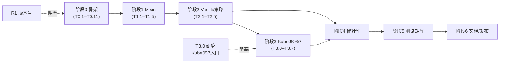

# ReloadOnlyRecipes 总任务表

> 依据：[reload-only-recipes-design.md](reload-only-recipes-design.md)（核心设计）+ [references/stonecutter.md](references/stonecutter.md) / [references/multiloader-build.md](references/multiloader-build.md) / [references/loader-platform-api.md](references/loader-platform-api.md)（双版本构建与平台差异）。
> 范围：**双版本**——Forge 1.20.1（Java 17，KubeJS 6）+ NeoForge 1.21.1（Java 21，KubeJS 7）；**纯 Java**；Stonecutter + Architectury Loom flat；核心是「`/reloadrecipes` 命令 + Mixin `@Invoker` 访问 `RecipeManager.apply` + KubeJS 软兼容」。
> 状态图例：☐ 待办 · ◐ 进行中 · ☑ 完成 · ⛔ 阻塞。复杂度：S 小 / M 中 / L 大。

---

## 里程碑

| 里程碑 | 目标 | 覆盖阶段 |
|---|---|---|
| **M0 骨架可跑** | 两版空 mod 能 `build` 且 `runClient` 进游戏 | 阶段 0 |
| **M1 核心可用** | 无 KubeJS 时 `/reloadrecipes` 能只重载 JSON 配方并同步客户端（两版） | 阶段 1–2 |
| **M2 KubeJS 兼容** | 有 KubeJS（6/7）时改 `server_scripts` 后 `/reloadrecipes` 生效（两版） | 阶段 3 |
| **M3 可发布** | 健壮性、i18n、测试矩阵通过，文档对齐 | 阶段 4–6 |

---

## 阶段 0 · 项目脚手架（双版本骨架）→ M0

| ID | 任务 | 复杂度 | 依赖 | 验收标准 | 涉及文件 |
|---|---|---|---|---|---|
| ☑ T0.1 | Gradle wrapper（≥9.0）+ Stonecutter 插件接入 | S | — | `gradlew` 可用；`stonecutter` 插件解析成功 | `gradle/wrapper/*`、`settings.gradle.kts` |
| ☑ T0.2 | `settings.gradle.kts`：仓库 + `stonecutter.create` 两节点 | S | T0.1 | 两节点 `1.20.1-forge`/`1.21.1-neoforge` 出现在 Gradle 项目树 | `settings.gradle.kts` |
| ☑ T0.3 | `stonecutter.gradle.kts`：`active` + `constants.match(loader,…)` | S | T0.2 | `//? if forge/neoforge` 常量可用 | `stonecutter.gradle.kts` |
| ☑ T0.4 | 节点 `gradle.properties`（mcVersion / fml / loom.platform / deps.kubejs） | S | T0.2 | 两节点属性齐全 | `versions/*/gradle.properties` |
| ☑ T0.5 | 根 `gradle.properties`（mod.id/name/version/group） | S | — | `mod.*` 可被 build 读取 | `gradle.properties` |
| ☑ T0.6 | 共享 `build.gradle.kts`（flat）：`loom.platform` 分支、Java 版本映射、`officialMojangMappings` | M | T0.3–T0.5 | 两版依赖解析成功；Java 17/21 正确 | `build.gradle.kts` |
| ☑ T0.7 | `createMinecraftArtifacts dependsOn stonecutterGenerate` | S | T0.6 | 构建用预处理后源码 | `build.gradle.kts` |
| ☑ T0.8 | **落地版本号**：NeoForge 21.1.x、Loom 版本、KubeJS 6/7 构建号（见「待验证项」R1） | S | T0.6 | 版本号确定并回写属性 | `versions/*/gradle.properties` |
| ☑ T0.9 | mod 主类 `@Mod`（`//? if` 隔离 forge/neoforge 总线 import） | M | T0.6 | 两版加载打印 `ReloadOnlyRecipes loaded` | `.../ReloadOnlyRecipes.java` |
| ☑ T0.10 | 元数据 `mods.toml` + `neoforge.mods.toml`（`modLoader=javafml`、`expand` 占位、KubeJS 软依赖声明） | M | T0.9 | `processResources` 输出正确、仅保留当前 loader 文件 | `META-INF/*.toml` |
| ☑ T0.11 | **验证 M0**：两版 `build` 绿 + `runClient` 进标题页/世界 | M | T0.9,T0.10 | 两版 runClient 均 `ReloadOnlyRecipes loaded` 抵主菜单、无 Exception（Agent1 运行验证） | — |

---

## 阶段 1 · Mixin 基础设施 → M1

| ID | 任务 | 复杂度 | 依赖 | 验收标准 | 涉及文件 |
|---|---|---|---|---|---|
| ☑ T1.1 | `reloadonlyrecipes.mixins.json`（package/refmap/mixins/plugin） | S | T0.11 | 两版启动加载 mixin 配置无错 | `resources/reloadonlyrecipes.mixins.json` |
| ☑ T1.2 | `RecipeManagerInvoker`（`@Invoker("apply")`，两版共用） | M | T1.1 | 编译期两版通过；refmap 生成 | `.../mixin/RecipeManagerInvoker.java` |
| ☑ T1.3 | `ReloadOnlyRecipesMixinPlugin`（`shouldApplyMixin` 用 `LoadingModList` 判断 `kubejs`） | M | T1.1 | 无 KubeJS 时 compat mixin 不加载、有则加载 | `.../mixin/ReloadOnlyRecipesMixinPlugin.java` |
| ☑ T1.4 | 在两个 `.toml` 声明 `[[mixins]] config=…` | S | T1.1 | mixin 实际生效 | `META-INF/*.toml` |
| ☐ T1.5 | **验证**：`((RecipeManagerInvoker) rm).invokeApply(...)` 可编译并在两版运行期解析 | S | T1.2–T1.4 | 临时调用不抛 `AbstractMethodError`/映射错误 | — |

---

## 阶段 2 · 核心功能（Vanilla 策略）→ M1

| ID | 任务 | 复杂度 | 依赖 | 验收标准 | 涉及文件 |
|---|---|---|---|---|---|
| ☑ T2.1 | `RecipeReloadStrategy` 接口 + `pick()`（先只返回 Vanilla） | S | T0.11 | 接口就绪（接口 ☑ PA-2；`pick()` ☑ PD-1 装配于 `RecipeReloadService`） | `.../reload/RecipeReloadStrategy.java` |
| ☑ T2.2 | `VanillaRecipeReloadStrategy`：`scan()`（`FileToIdConverter.json("recipes")`）+ `invokeApply` | M | T1.5,T2.1 | 扫描出全部来源配方并重建 | `.../reload/VanillaRecipeReloadStrategy.java` |
| ☐ T2.3 | `RecipeSync`：`ClientboundUpdateRecipesPacket` + `sendInitialRecipeBook`（两版一致） | M | T2.2 | 在线客户端配方书/JEI 刷新 | `.../reload/RecipeSync.java` |
| ☑ T2.4 | `/reloadrecipes` 命令注册（`RegisterCommandsEvent`，`//? if` 隔离 import，权限 2，成功反馈） | M | T2.1 | 命令可执行、有反馈、OP 限制 | `.../command/…`、主类事件 |
| ☐ T2.5 | **验证 M1**：无 KubeJS，改数据包 JSON 配方 → 执行命令 → 服务端与客户端均更新（两版） | M | T2.2–T2.4 | **Forge 服务端已通过**（runServer `/reloadrecipes` → 1174 配方 50ms 重建、mixin `@Invoker` 生效、翻译正常）；NeoForge / 客户端 JEI·REI 刷新 / 改包即时生效待测 | — |

---

## 阶段 3 · KubeJS 兼容（6/7 版本化）→ M2

| ID | 任务 | 复杂度 | 依赖 | 验收标准 | 涉及文件 |
|---|---|---|---|---|---|
| ☑ T3.0 | **研究**：核实 KubeJS 7（`2101`）`ServerScriptManager` 脚本重载公开入口 + `RECIPES_AFTER_LOADED` 触发方式（见 R2） | M | — | 明确 7 代等价 `wrapResourceManager` 的调用方式 | 研究/文档 |
| ☑ T3.1 | `modCompileOnly` 接入 KubeJS（6 forge / 7 neoforge，`exclude` animated-gif-lib） | S | T0.8 | 两版配置阶段不因 JitPack 失败 | `build.gradle.kts` |
| ☑ T3.2 | 干净资源管理器工具（`PackRepository.openAllSelected` + `close()`，两版一致） | S | T2.2 | 不叠加 KubeJS 虚拟包、无句柄泄漏 | `.../reload/CleanServerResources.java` |
| ☑ T3.3 | 兼容层骨架 `compat/kubejs/`（类隔离，`pick()` 接 `ModList.isLoaded("kubejs")`） | M | T3.1,T2.1 | 无 KubeJS 时不链接这些类 | `.../compat/kubejs/…` |
| ☑ T3.4 | **KubeJS 6（Forge）实现**：`wrapResourceManager` → `invokeApply`（HEAD cancel）→ `postAfterRecipes()` | L | T3.2,T3.3 | 1.20.1 改脚本后命令生效 | `compat/kubejs/`（`//? if forge`） |
| ☐ T3.5 | **KubeJS 7（NeoForge）实现**：重跑脚本入口（T3.0）→ `invokeApply`（HEAD/TAIL 自动介入）；`kjs$resources` 有效性检查 | L | T3.0,T3.2,T3.3 | 1.21.1 改脚本后命令生效 | `compat/kubejs/`（`//? if neoforge`） |
| ☑ T3.6 | 回落逻辑：兼容 API 缺失/异常时回落 Vanilla 策略并告警 | M | T3.4,T3.5 | KubeJS 版本不匹配不崩溃 | `compat/kubejs/`、`pick()` |
| ☐ T3.7 | **验证 M2**：有 KubeJS（Forge6/NeoForge7），改 `server_scripts` → 命令生效、客户端刷新 | M | T3.4–T3.6 | 脚本增删改配方即时生效 | — |

---

## 阶段 4 · 健壮性与体验 → M3

| ID | 任务 | 复杂度 | 依赖 | 验收标准 |
|---|---|---|---|---|
| ☑ T4.1 | 错误处理：扫描单文件失败跳过、`apply` 异常捕获、整体失败回落 + 日志 | M | T2.5 | 单个坏配方不中断整体 |
| ☑ T4.2 | 日志与统计：重载条数、耗时、来源包数 | S | T2.5 | 执行后输出可诊断信息 |
| ☐ T4.3 | 命令反馈 + i18n（`en_us` / `zh_cn`） | S | T2.4 | 反馈本地化、含条数/耗时（lang 资源 ✅ PB-5；命令 `translatable` 调用待 PB-4） |
| ☐ T4.4 | 权限/配置：权限等级、可选开关（是否同步配方书等） | S | T2.4 | 可配置、默认合理 |
| ☐ T4.5 | 边界提示：命令帮助注明「不重载 tags/loot」「不覆盖 CraftTweaker 等 B 类 mod」 | S | T2.4 | 用户可预期行为边界 |

---

## 阶段 5 · 测试与验证矩阵 → M3

| ID | 任务 | 复杂度 | 依赖 | 验收标准 |
|---|---|---|---|---|
| ☐ T5.1 | 两版 `build`（含任何单测）绿 | S | 阶段 4 | 两节点 `build` 成功 |
| ☐ T5.2 | 两版 `runClient` 冒烟 | S | 阶段 4 | 进游戏无异常 |
| ☐ T5.3 | 功能矩阵：{无 KubeJS, KubeJS6/Forge, KubeJS7/NeoForge} × {文件夹, zip 数据包} × {JEI, REI} | L | T2.5,T3.7 | 各组合配方更新 + 客户端刷新 |
| ☐ T5.4 | 资源健壮性：重复包装、句柄泄漏、多次连续执行 | M | T3.7 | 无泄漏、可反复执行 |
| ☐ T5.5 | 性能对比：大整合包 `/reload` vs `/reloadrecipes` 耗时 | M | T2.5 | 明显快于完整 reload（量化） |

---

## 阶段 6 · 文档与发布 → M3

| ID | 任务 | 复杂度 | 依赖 | 验收标准 |
|---|---|---|---|---|
| ☐ T6.1 | 对齐设计文档到双版本（NeoForge 无 SRG、KubeJS 6/7 分支、平台差异引用） | M | 阶段 3 | 设计文档与实现一致 |
| ☐ T6.2 | `README`：用法、权限、兼容性、限制、支持版本 | S | 阶段 4 | 用户可据此使用 |
| ☐ T6.3 | 发布配置（可选：CI 构建两版、产物命名） | M | T5.1 | 可产出两版发布 jar |

---

## 关键路径 / 依赖图

> 关键路径：**T0 → T1 → T2 → T3 → T4 → T5**。阶段 2 完成即达 M1（核心可独立交付，不依赖 KubeJS）。

---

## 阻塞性待验证项（研究任务）

| ID | 事项 | 影响任务 | 处理方式 |
|---|---|---|---|
| ☑ R1 | **已落地（PA-1/Agent2）**：Gradle 9.0.0、Stonecutter 0.9.6、Loom 1.14.473、Forge 47.4.4、NeoForge 21.1.193、KubeJS 2001.6.5-build.26 / 2101.7.2-build.369 | T0.8, T3.1 | ✅ 查 Maven metadata 并回写 `versions/*/gradle.properties` |
| ☑ R2 | **已核实（PA-3/Agent3）**：入口＝`ServerScriptManager.reload()`（via `RecipeManagerKJS.kjs$getResources().kjs$getServerScriptManager()`）；`kjs$resources` 复用持久有效；7 代**无需干净 RM**；`RECIPES_AFTER_LOADED` 可选。详见 parallel-tasks §5 / loader-platform-api §6.2 | T3.0, T3.5 | ✅ 已通读 `2101` 源码 |
| ☐ R3 | NeoForge `neoforge.mods.toml` 的 `loaderVersion` 合理范围 | T0.10 | PA-1 已给初值 `[4,)`（forge `[47,)`）；待 Gate A `runClient` 确认被接受 |
| ☑ R4 | **已落地（PA-1）**：用 `property("loom.platform")` 取 forge/neoforge 字符串；分支判断用 `loom.platform.get() == ModPlatform.FORGE` 枚举 | T0.6 | ✅ 配置阶段编译通过 |

---

## 风险登记（源自设计 §8）

| 风险 | 等级 | 缓解 | 关联任务 |
|---|---|---|---|
| 资源管理器重复包装 / 句柄泄漏 | 高 | `openAllSelected` 重建干净 RM + `finally close()` | T3.2, T5.4 |
| 强耦合 KubeJS 内部（版本更新易失效） | 高 | 版本化兼容层 + 缺失时回落 Vanilla + 告警 | T3.4–T3.6 |
| B 类 mod（CraftTweaker）不被覆盖 | 中 | 文档明确边界；不在本期范围 | T4.5 |
| 只重载配方不含 tags/loot | 中 | 命令帮助提示；纯 JSON 配方场景不受影响 | T4.5 |
| 双版本 API 分叉导致维护成本 | 中 | Stonecutter `//? if` 最小化隔离面（仅 import + KubeJS 层） | 阶段 2–3 |

---

## 验收（Definition of Done）

- ☐ 两版（Forge 1.20.1 / NeoForge 1.21.1）均 `build` 绿、`runClient` 进游戏。
- ☐ 无 KubeJS：改 JSON 配方 → `/reloadrecipes` → 服务端 + 客户端更新（M1）。
- ☐ 有 KubeJS（6/7）：改 `server_scripts` → `/reloadrecipes` → 生效（M2）。
- ☐ 功能矩阵（T5.3）全绿；无句柄泄漏；性能显著优于 `/reload`。
- ☐ i18n、错误回落、边界提示完备；设计文档与实现一致。

> 建议实现顺序：**先交付 M1（Vanilla，双版本，零 KubeJS 依赖）**，再叠加 M2（KubeJS 6/7），最后 M3 打磨。M1 本身即为可用产物。
